Applied Social Network Analysis in Python
=========================================

by University of Michigan

# Module 1
#
## Title: Why Study Networks and Basics on NetworkX

### Networks: Definition and Why We Study Them

#### **Network**

* A set of objects, which are known as **nodes**, that have some relationships between each other, which are known as **edges**
* Why study Network?
	1. The first reason why we want to study networks, is because networks are everywhere
* Types
	1. Social Network
		* In social networks the nodes are people, and the connections between the nodes represent some type relationship between the people in the network
		* For example
			1. In an image below, you can see network of 34 people who belong to a karate club, and the network represents friendship between them
				* In this example, **node number one** (marked with __*1*__), is the instructor in the karate club and everybody else is a student in the karate club
					<p align="center">
					  <a href="javascript:void(0)" rel="noopener">
					 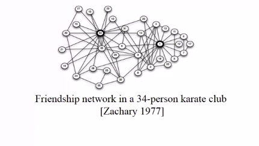</a>
					</p>
		1. In an image below, you can see a **Network of Friendship**, marital tie, and family tie among 2,200 people
			* Here the edges are colored to represent the particular type of relationship between the nodes
				<p align="center">
				  <a href="javascript:void(0)" rel="noopener">
				 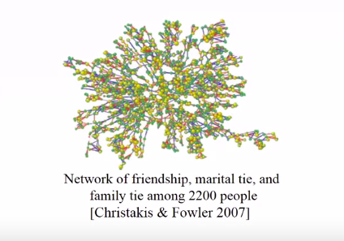</a>
				</p>
		1. In an image below, you can see an **e-Mail Communication Network**, we have a network between 436 HP employees and the edges represent communication through email.
			<p align="center">
			  <a href="javascript:void(0)" rel="noopener">
			 </a>
			</p>
	1. Transportation and Mobility Networks
		1. Network of Direct Flights around the world
			* We see a network of directed flights between the different airports around the world.
				<p align="center">
				  <a href="javascript:void(0)" rel="noopener">
				 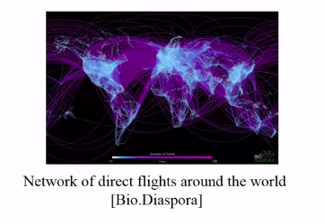</a>
				</p>
		1. Human Mobility Network that is based on the location of dollar bills using the words George website, where people look at their dollar bills, tells the website where they are located
			* And then this bill can be track when other people update the location of this bill
			* We can see this bill has travel throughout the United States, and here is the network I gets more by tracking bills movement
				<p align="center">
				  <a href="javascript:void(0)" rel="noopener">
				 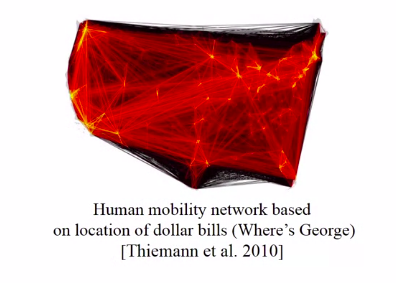</a>
				</p>
		1. Bus Transportation Network of Ann Arbor
			* Here the edges represent direct bus routes from one stop to the next stop
				<p align="center">
				  <a href="javascript:void(0)" rel="noopener">
				 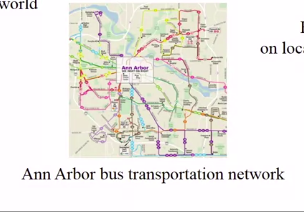</a>
				</p>
	1. Information Network
		1. Communication between left-wing and right-wing Political Blog
			* We see network where the nodes are political blogs and then edges represent connections between the blogs through URLs
			* What blog links to which blog? And what we see here is that they're colored by one of their left wing or right wing
				* And what we see is that left-wing blogs tend to connect mainly to left-wing blogs, and right-wing blogs tend to connect mainly to right-wing blogs, but there are not a lot of connections that go from one to the other
				* So we call this **clustering**, there's a lot of clustering between the two types of blogs
					<p align="center">
					  <a href="javascript:void(0)" rel="noopener">
					 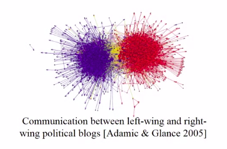</a>
					</p>
		1. Network of Internet Connectivity
			<p align="center">
			  <a href="javascript:void(0)" rel="noopener">
			 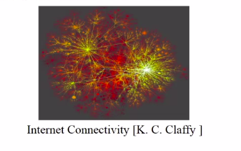</a>
			</p>
		1. Network of Wikipedia Articles about Climate Change
			* The edges also represent URL connections or direct connections between one article and the next
			* And here we can also see that there is some clustering happening. So the colors represent different sub-topping within climate change, and we can see that they are clustered by the different sub-toppings
				<p align="center">
				  <a href="javascript:void(0)" rel="noopener">
				 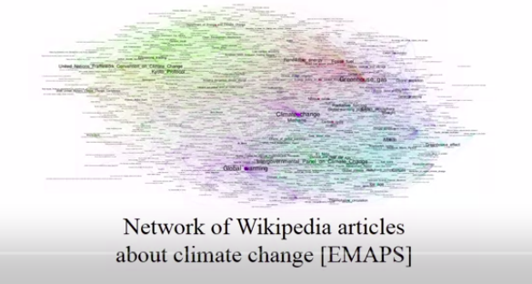</a>
				</p>
	1. Biological Networks
		1. Protein-to-protein Interaction Network
			* So the nodes are proteins and they're connected by where they interact with each other
				<p align="center">
				  <a href="javascript:void(0)" rel="noopener">
				 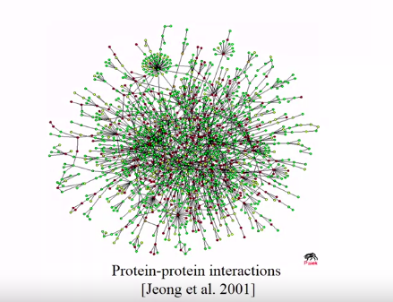</a>
				</p>
		1. Food Web Network
			* It represents, what animals eat what animals.
				<p align="center">
				  <a href="javascript:void(0)" rel="noopener">
				 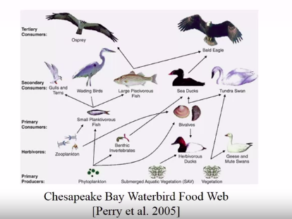</a>
				</p>
	1. Financial Networks
	1. Co-authorship Networks
	1. Trade Networks
	1. Citation Network
* Considering e-mail Communication Network, the kind of questions that we can answer are
	1. if there's a rumor that starts in some part of the network, is it likely to spread through the whole network?
	1. who are the most influential people in this organization?
	1. Is the rumor that's starting on say, some node that's sort of like on the outskirts of the network more or less likely to be spread than if it were to be started by somebody who's more central to the network, like someone around this area?
		<p align="center">
		  <a href="javascript:void(0)" rel="noopener">
		 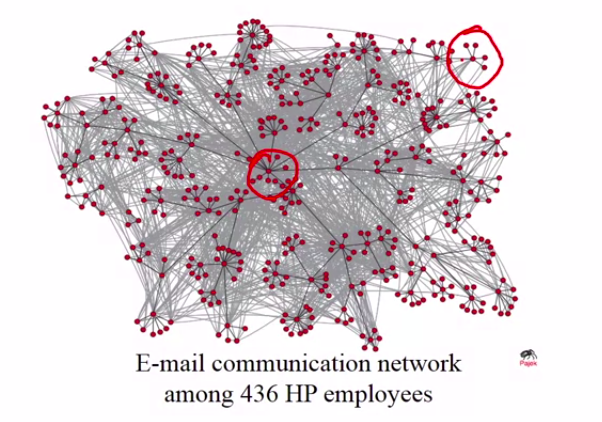</a>
		</p>
* Considering Friendship Network at karate Club, the kind of questions that we can answer are
	1. Is this club likely to split into two different clubs?
		1. If so, which nodes will go to which group?
			* Actually the story is that, this is exactly what happens. If you could try to guess which member is going to join which club after it splits, you can look at the structure of this network and make a pretty educated guess
				* And it turns out that, as you can probably see from just looking at this network, the division between the club happens around this red line marked in image, where the nodes on the left side of this line go to one club, and then the ones on the right go to the other club
					<p align="center">
					  <a href="javascript:void(0)" rel="noopener">
					 </a>
					</p>
* Considering Network of Direct Flights around the world
	1. If there's an epidemic or a virus spreading in the world, are there airports that we have to pay more attention to than others?
		* Which airports are at highest risk for virus spreading?
	1. If there are certain parts of the world that are harder to reach through air transportation, what are key connections we can make to make those areas easier to reach?
		* Are some parts of the worlds more difficult to reach?
			<p align="center">
			  <a href="javascript:void(0)" rel="noopener">
			 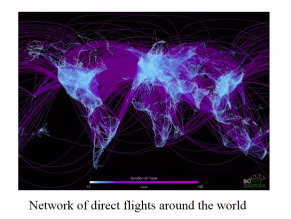</a>
			</p>

##### Review 

1. Many complex structures can be modeled through networks		
1. By studying the structure of these Networks
	* we can start to answer questions that are pretty complex
		* And deal with very complex relationships and networks allow us to make those relationships, or to make those complex phenomena simpler by representing them as a network and then using certain tools that allow us to answer that

### Network Definition and Vocabulary

* A **Network** , which we also call a **Graph**, is a representation of connections among different sets
	* For Example
		* Check image below, A set of things which we call nodes, just circles that have labels A through G, So we call these things nodes or vertices
		* Connections between them that can represent various different things and we call these connections **edges**, or sometimes we call them **links** or **ties** as well
			<p align="center">
			  <a href="javascript:void(0)" rel="noopener">
			 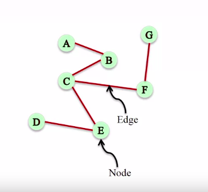</a>
			</p>
			<p align="center">
			  <a href="javascript:void(0)" rel="noopener">
			 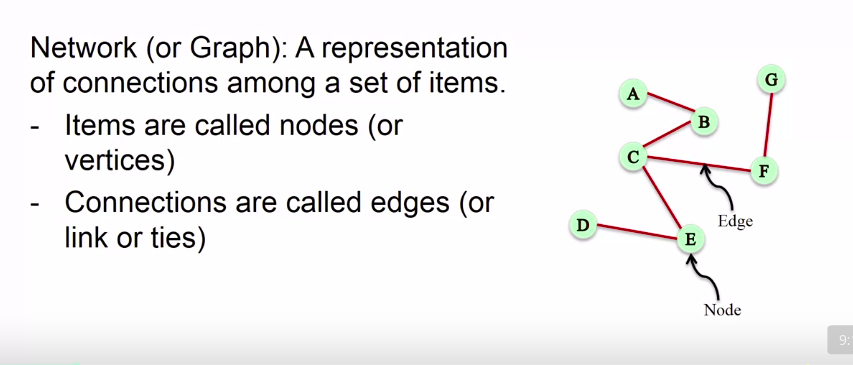</a>
			</p>
		* Using NETWORKX in python
				<p align="center">
				  <a href="javascript:void(0)" rel="noopener">
				 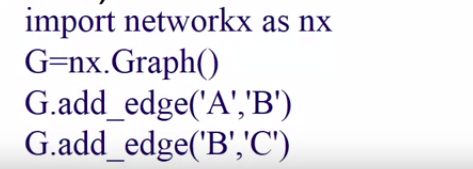</a>
				</p>
			```python
			>>> import networkx as nx
			>>> G = nx.Graph()
			>>> G.add_edges('A', 'B')
			>>> G.add_edges('B', 'C')
			>>> # Similarly we can add other nodes in network as shown in figure
			```
		* If the pairs of nodes that you're adding are not in the graph already, **NetworkX** will automatically add them to the graph
* *Network* of **Friendship**
		<p align="center">
		  <a href="javascript:void(0)" rel="noopener">
		 </a>
		</p>
	* This is a network between people and the edges here represent friendship, marital ties and family ties among 2,200 people
		* **Nodes** : People
		* **Edges** : Friendship, marital, or family ties
		* Mostly **Symmetric relationships**
	* When you look at this network one thing that you can see is that these edges are mostly symmetric relationships
		* that is, if A is a friend of B, then B is also a friend of A. At least most of the time, that's the case
* Food Web Network
		<p align="center">
		  <a href="javascript:void(0)" rel="noopener">
		 </a>
		</p>
	* This network represents what animals eat other animals
		* **Nodes** : Birds
		* **Edges** : What eats what
		* **Asymmetric relationships**
	* For Example
		* It's very different if you have an edge pointing from the fish to the eagle
			* That says that the eagle eats the fish, rather than the other way around
		* So the direction of the edge in this network has a very important meaning to what the edge is trying to represent
* From the examples above we can see that we need at least **Two Different types of Networks**
	* **Undirected Network**
		* These are undirected networks, meaning the edges don't have any direction, or that the direction of the edge is not really important
			<p align="center">
			  <a href="javascript:void(0)" rel="noopener">
			 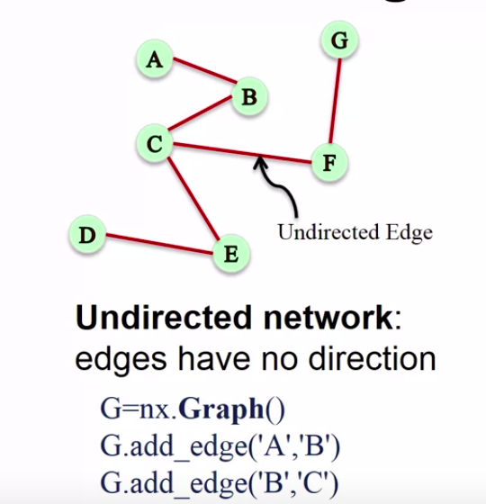</a>
			</p>
		* In **NetworkX** we use the **class** **Graph** to represent these types of networks
	* **Directed Network**
		* These are directed networks, meaning the edges have direction, or that the direction of the edge is really important
		* In **NetworkX** we use the **class** **DiGraph** (**Directed Graph**) to represent these types of networks
			<p align="center">
			  <a href="javascript:void(0)" rel="noopener">
			 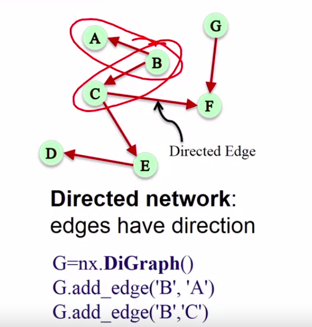</a>
			</p>
		* For Example (Refer to the image above)
			* So we will be adding the edge B, A and then the edge B, C
				* Notice that now the order matters. So it's very different to add the edge B, C than adding the edge C, B, because now these have directions
* **Weighted Network** 
	* **Weighted Network** is a network where edges are assigned a particular weight, typically a numerical weight, that has some meaning in the relationship between the two nodes
	* The intuition here is that in some networks
		* Not all relationships are equal
		* Some edges carry different weight than others, so we want a way of capturing this
	* For Example
		* A network where the nodes are people and then the edges represent how many times they had lunch together. These are coworkers
			<p align="center">
			  <a href="javascript:void(0)" rel="noopener">
			 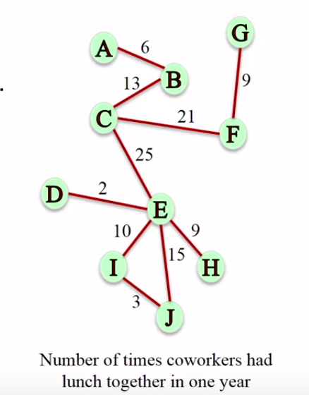</a>
			</p>
		* so if you look for example at edge A, B, A and B had lunch together six times. Whereas the edge C, E, which says that the nodes C and E had lunch together 25 times
			* Those are two very different relationships, and so we want a way of capturing this weight
				<p align="center">
				  <a href="javascript:void(0)" rel="noopener">
				 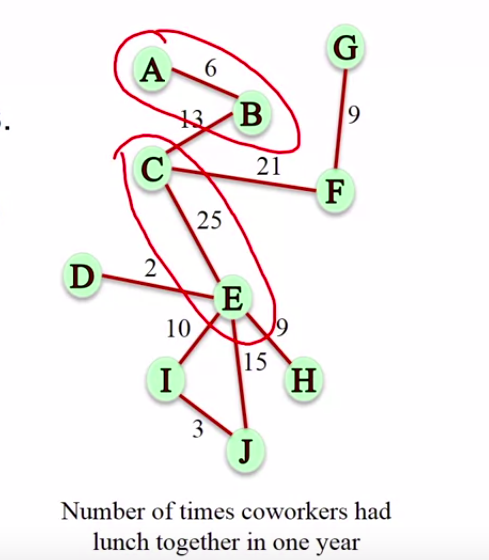</a>
				</p>
	* In **NetworkX**, we can represent these types of networks also by using the class **Graph**
		* But what have to do is when we add an edge, for example the edge A, B, we have to add an attribute weight as well
			```python
			>>> import networkx as nx
			>>> G = nx.Graph()
			>>> G.add_edges('A', 'B', weight=6)
			>>> G.add_edges('B', 'C', weight=13)
			>>> # Similarly we can add other nodes in network as well
			```
* **Signed Network**
	* **Signed Network** is a network where the edges, instead of having a weight, they have a positive or negative sign
		<p align="center">
		  <a href="javascript:void(0)" rel="noopener">
		 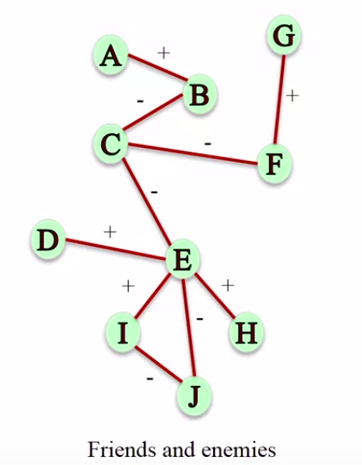</a>
		</p>
	* Some networks can carry information about friendship but also about antagonism between people, which could happened due to conflict or disagreement
	* For example
		* the websites Epinions and Slashdot give people the ability to declare not only who their friends are, but also who their enemies are
	* In **NetworkX**, we can represent these types of networks also by using the class **Graph**
		```python
		>>> import networkx as nx
		>>> G = nx.Graph()
		>>> G.add_edges('A', 'B', sign='+')
		>>> G.add_edges('B', 'C', sign='-')
		>>> # Similarly we can add other nodes in network as well
		```
* Other Edge Attributes
	* Edges can carry many other labels or Attributes
		* Relation
			1. Friend
			1. Family
			1. Coworker
			1. Neighbor
		* Example
			<p align="center">
			  <a href="javascript:void(0)" rel="noopener">
			 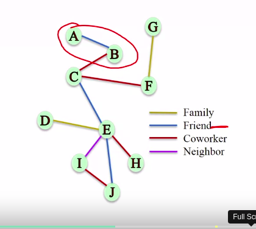</a>
			</p>
	* In **NetworkX**, we can represent these types of networks also by using the class **Graph**
		```python
		>>> import networkx as nx
		>>> G = nx.Graph()
		>>> G.add_edges('A', 'B', relation='friend')
		>>> G.add_edges('B', 'C', relation='coworker')
		>>> G.add_edges('D', 'E', relation='family')
		>>> # Similarly we can add other nodes in network as well
		```
* **MultiGraphs Network**
	* A pair of nodes can have different types of relationships simultaneously
	* Intuition for multigraphs is that for a single pair of of nodes, there is no reason why they shouldn't be able to have many different relationships at the same time
	* **MultiGraphs Network** is a network where multiple edges can connect the same pair of nodes. They're also called parallel edges
		<p align="center">
		  <a href="javascript:void(0)" rel="noopener">
		 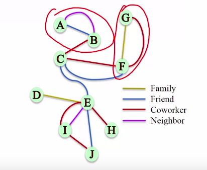</a>
		</p>
	* In **NetworkX**, we can represent these types of networks also by using the class **MultiGraph**
		```python
		>>> import networkx as nx
		>>> G = nx.MultiGraph()
		>>> G.add_edges('A', 'B', relation='friend')
		>>> G.add_edges('A', 'B', relation='neighbor')
		>>> G.add_edges('G', 'F', relation='family')
		>>> G.add_edges('G', 'F', relation='coworker')
		>>> # Similarly we can add other nodes in network as well
		```


> We would like to construct a graph on NetworkX, where the nodes represent employees of a company and the edges represent the number of times an employee sent an email to another employee. What would be the best way to represent this network?
> Since we want to capture who sent the email and who received it, we need a directed graph. Since we also want to capture the number of times an employee emailed another, we want the edges to have weights, hence we want to use a weighted, directed graph

##### Summary

1. We have undirected networks or undirected graphs, which we use the Graph class in order to represent them
1. We have directed graphs for which we use the DiGraph class
1. We have sign networks for which we use the Graph class but we assign attribute to the edges when we add them
1. We have multigraphs, and for those we use the MultiGraph class, and those can handle multiple edges for each pair of notes
1. We have the weighted networks for which we add a weight attribute in the edges when we add the edges
	<p align="center">
	  <a href="javascript:void(0)" rel="noopener">
	 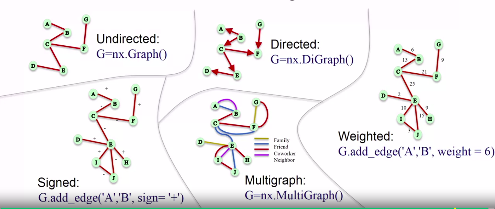</a>
	</p>


### Node and Edge Attributes

* Example of a network where 
	* the color of the edges represent the relationship between the nodes
	* the number on the edges that represents how many times they had lunch together
		<p align="center">
		  <a href="javascript:void(0)" rel="noopener">
		 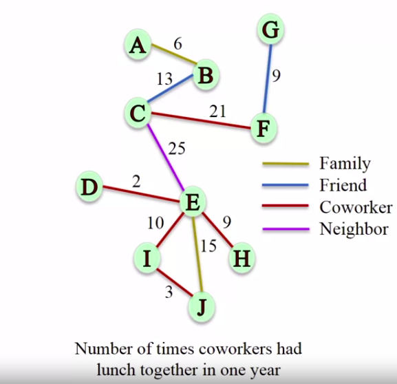</a>
		</p>
* Once loaded, how to access **edge attributes** data using NetworkX lib
	* Since we are taking an example of **undirected graph**, therefore order in which we will place the end points of the edge does not matter
			<p align="center">
			  <a href="javascript:void(0)" rel="noopener">
			 </a>
			</p>
		```python
		>>> import networkx as nx
		>>> G = nx.Graph()
		>>> G.add_edges('A', 'B', weight=6, relation='family')
		>>> G.add_edges('B', 'C', weight=13, relation='friend')
		>>>
		>>> # To get list of all edges
		>>> G.edges()
			[('A', 'B'), ('C', 'B')]
		>>>
		>>> # To get list of all edges with attributes
		>>> G.edges(data=True)
			[('A', 'B', {'relation': 'family', 'weight': 6}), ('C', 'B', {'relation': 'friend', 'weight': 13})]
		>>>
		>>> # To get list of all edges with attribute 'relation'
		>>> G.edges(relation=True)
			[('A', 'B', 'family'), ('C', 'B', 'friend')]
		>>>
		>>> # To access attributes of particular edge
		>>> # dictionary of attributes of edge (A, B)
		>>> G.edge['A']['B']
			{'relation': 'family', 'weight': 6}
		>>>
		>>> # To get the weight of edge (B, C)
		>>> G.edge['B']['C']['weight']
			13
		>>> G.edge['C']['B']['weight'] # undirected graph, order does not matter
			13
		```
	* In case of **directed graph**
			<p align="center">
			  <a href="javascript:void(0)" rel="noopener">
			 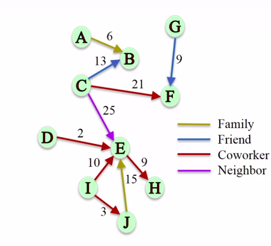</a>
			</p>
		```python
		>>> import networkx as nx
		>>> G = nx.DiGraph()
		>>> G.add_edges('A', 'B', weight=6, relation='family')
		>>> G.add_edges('C', 'B', weight=13, relation='friend')
		>>>
		>>> # To get the weight of edge (C, B)
		>>> G.edge['C']['B']['weight']
			13 
		>>> G.edge['B']['C']['weight'] # Order matters in this type of Network
			KeyError: 'C'
		```
	* In case of **multigraph**
		* Undirected MultiGraph
				<p align="center">
				  <a href="javascript:void(0)" rel="noopener">
				 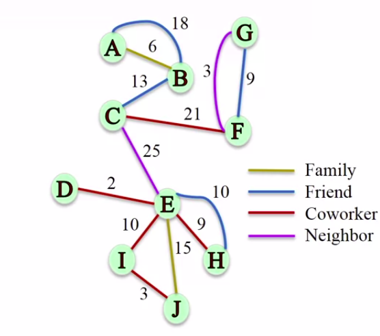</a>
				</p>
			```python
			>>> import networkx as nx
			>>> G = nx.MultiGraph()
			>>> G.add_edges('A', 'B', weight=6, relation='family')
			>>> G.add_edges('A', 'B', weight=18, relation='friend')
			>>> G.add_edges('C', 'B', weight=13, relation='friend')
			>>>
			>>> # To get one dictionary of attributes per (A, B) edge
			>>> G.edge['A']['B']
				{0: {'relation' : 'family', 'weight': 6}, 
					1: {'relation': 'friend', 'weight': 18}}
			>>>
			>>> # as it is undirected graph, order does not matter
			>>> G.edge['A']['B'][0]['weight']
				6 
			>>> G.edge['A']['B'][1]['weight']
				18 
			```
		* Directed MultiGraph
				<p align="center">
				  <a href="javascript:void(0)" rel="noopener">
				 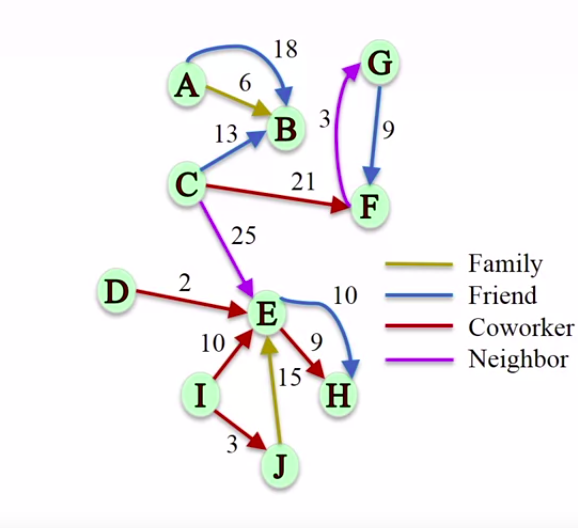</a>
				</p>
			```python
			>>> import networkx as nx
			>>> G = nx.MultiDiGraph()
			>>> G.add_edges('A', 'B', weight=6, relation='family')
			>>> G.add_edges('A', 'B', weight=18, relation='friend')
			>>> G.add_edges('C', 'B', weight=13, relation='friend')
			>>>
			>>> # To get one dictionary of attributes per (A, B) edge
			>>> G.edge['A']['B']
				{0: {'relation' : 'family', 'weight': 6}, 
					1: {'relation': 'friend', 'weight': 18}}
			>>>
			>>> # as it is directed graph, order does matter
			>>> G.edge['A']['B'][0]['weight']
				6 
			>>> G.edge['B']['A'][0]['weight']
				KeyError: 'A'
			```
* Once loaded, how to **access node attributes** data using NetworkX lib
	* The nodes can also have a particular attribute, so in this case, imagine they're colored by their role in the company. So some are managers, some are traders and some are analysts.
			<p align="center">
			  <a href="javascript:void(0)" rel="noopener">
			 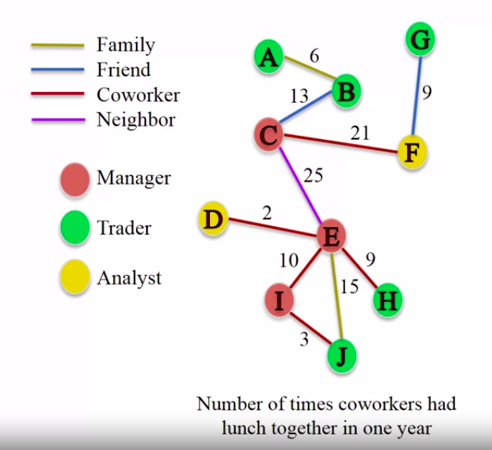</a>
			</p>
		```python
		>>> import networkx as nx
		>>> G = nx.Graph()
		>>> G.add_edges('A', 'B', weight=6, relation='family')
		>>> G.add_edges('C', 'B', weight=13, relation='friend')
		>>>
		>>> G.add_node('A', role='trader')
		>>> G.add_node('B', role='trader')
		>>> G.add_node('C', role='manager')
		>>>
		>>> # To get list of all the nodes
		>>> G.nodes()
			['A', 'C', 'B']
		>>>
		>>> # To get list of all the nodes with attributes
		>>> G.nodes(data=True)
			[('A', {'role': 'trader'}), ('C', {'role': 'manager'}), ('B', {'role': 'trader'})]
		>>>
		>>> # To get attribute for a particular Node
		>>> G.node['A']['role']
			'trader'
		```

##### Summary

1. We looked at how we add and access
	1. attributes for nodes
	1. attributes for edges
1. Depending on what we want, sometimes we want a list of 
	1. all the edges, sometimes we're interested in a particular edge
	1. all the nodes, sometimes we're interested in a particular node
		<p align="center">
		  <a href="javascript:void(0)" rel="noopener">
		 </a>
		</p>

### Bipartite Graphs

* **Bipartite Graphs** - a graph is a bipartite graph if it has two sets of nodes which we call L and R, and every single edge connects a node from L to R
	* So, no edge connects a node from L to another node in L, and no edge connects a node in R to another node in R
			<p align="center">
			  <a href="javascript:void(0)" rel="noopener">
			 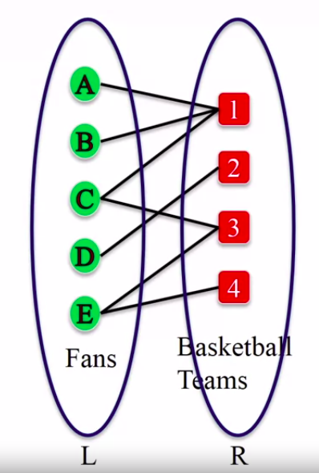</a>
			</p>
		```python
		>>> from networkx.algorithms import bipartite
		>>> B = nx.Graph() # As there is no separate class for Bipartite Graph
		>>>
		>>> # these set of nodes are going to be one side of my bipartite graph, in this case would be LEFT SIDE
		>>> B.add_nodes_from(['A', 'B', 'C', 'D', 'E'], bipartite=0) # label one set of node 0
		>>> 
		>>> # these set of nodes are going to be other side of my bipartite graph, in this case would be RIGHT SIDE
		>>> B.add_nodes_from([1, 2, 3, 4], bipartite=1) # label other set of node 1
		>>> 
		>>> B.add_edges_from([('A', 1), ('B', 1), ('C', 1), ('C', 3), ('D', 2), ('E', 3), ('E', 4)])
		```
		<p align="center">
		  <a href="javascript:void(0)" rel="noopener">
		 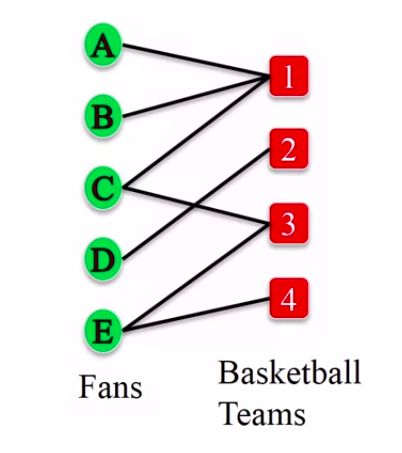</a>
		</p>
* Which graph is Bipartite Graph?
	* Graph A is bipartite: the two sets of nodes are {A,B,C} and {E,G,F}. All edge connect a node in one set to a node in the other set. Graph B is not bipartite: note that nodes C, B, and F form a triangle, so it is not possible to assign each of these nodes to a side without having edges connecting nodes that were assigned to the same side. In fact, for the same reason, a bipartite graph cannot contain a cycle of an odd number of nodes.
		<p align="center">
		  <a href="javascript:void(0)" rel="noopener">
		 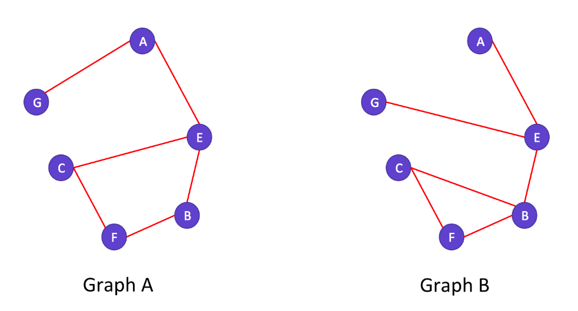</a>
		</p>
* Check if graph is bipartite
	```python
	>>> from networkx.algorithms import bipartite
	>>> B = nx.Graph() # As there is no separate class for Bipartite Graph
	>>> B.add_nodes_from(['A', 'B', 'C', 'D', 'E'], bipartite=0) # label one set of node 0
	>>> B.add_nodes_from([1, 2, 3, 4], bipartite=1) # label other set of node 1
	>>> B.add_edges_from([('A', 1), ('B', 1), ('C', 1), ('C', 3), ('D', 2), ('E', 3), ('E', 4)])
	>>>
	>>> # To check if B is barpartite
	>>> bipartite.is_bipartite(B)
		True
	>>> 
	>>> B.add_edge('A', 'B')
	>>> bipartite.is_bipartite(B)
		False
	>>>
	>>> B.remove_edge('A', 'B')
	>>> bipartite.is_bipartite(B)
		True
	```
* Check if set of notes is bipartition of the graph, i.e. if is this set of nodes one of the two sets of nodes, such that all the edges go from one set to the other
	```python
	>>> X = set([1, 2, 3, 4])
	>>> bipartite.is_bipartite_node_set(B, X)
		True
	>>> X = set(['A', 'B', 'C', 'D', 'E'])
	>>> bipartite.is_bipartite_node_set(B, X)
		True
	>>> X = set([1, 2, 3, 4, 'A'])
	>>> bipartite.is_bipartite_node_set(B, X)
		False
	```
* Getting each set of nodes of a bipartite graph
	* if we don't know which two sets are the two bipartitions of the graph, then we can ask NetworkX to output those two sets
		```python
		>>> bipartite.sets(B)
			[{'A', 'B', 'C', 'D', 'E'}, {1, 2, 3, 4}]
		>>> 
		>>> B.add_edge('A', 'B')
		>>> bipartite.sets(B)
			NetworkXError: Graph is not bipartite,
		>>> 
		>>> B.add_edge('A', 'B')
		```
* **Projected Graph** 
	* It is called **L-bipartite graphs projection** of the bipartite graph
		* It is a network among the nodes in one side of the group, in this case the L side, in this case the fans, where each pair of nodes is connected if they have a common neighbor in the R side of the bipartite graph
		* So, in this case, there would be exactly the network between the fans, such that they're connected if they have at least one team in common
	* **Network of fans will have at least one team in common**
			<p align="center">
			  <a href="javascript:void(0)" rel="noopener">
			 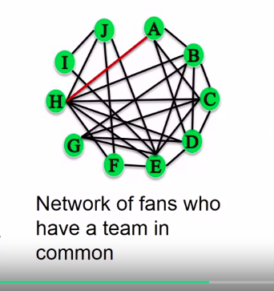</a>
			</p>
		*  So in this network, the edge A, H, appears in the projection because both A and H are fans of Team 1, and the edge J, E, appears in this network because they're both fans of team 4
		* Python Code for Projected Graph
			1. Graph for Left side
				```python
				>>> B = nx.Graph()
				>>> B.add_edges_from([('A', 1), ('B', 1), ('C', 1), ('D', 1), ('H', 1), ('B', 2), ('C', 2), ('D', 2), ('E', 2), ('G', 2), ('E', 3), ('F', 3), ('H', 3), ('J', 3), ('E', 4), ('I', 4), ('T', 4), ('J', 4)])
				>>> 
				>>> X = set(['A', 'B', 'C', 'D', 'E', 'F', 'G', 'H', 'I', 'J'])
				>>> P = bipartite.projected_graph(B, X)
				```
				* Network that will come out from code above is 
					<p align="center">
					  <a href="javascript:void(0)" rel="noopener">
					 </a>
					</p>
			1. Graph for Right side
				```python
				>>> B = nx.Graph()
				>>> B.add_edges_from([('A', 1), ('B', 1), ('C', 1), ('D', 1), ('H', 1), ('B', 2), ('C', 2), ('D', 2), ('E', 2), ('G', 2), ('E', 3), ('F', 3), ('H', 3), ('J', 3), ('E', 4), ('I', 4), ('T', 4), ('J', 4)])
				>>> 
				>>> X = set([1, 2, 3, 4])
				>>> P = bipartite.projected_graph(B, X)
				```
				* Network that will come out from code above is 
					<p align="center">
					  <a href="javascript:void(0)" rel="noopener">
					 </a>
					</p>
	* **L-bipartite Weighted Graphs Projection** of the bipartite graph
		* An L-bipartite graph projection with weights on the edges that are proportional to the number of common neighbor between the nodes
				<p align="center">
				  <a href="javascript:void(0)" rel="noopener">
				 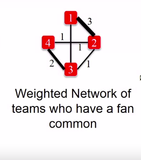</a>
				</p>
			```python
			>>> B = nx.Graph()
			>>> B.add_edges_from([('A', 1), ('B', 1), ('C', 1), ('D', 1), ('H', 1), ('B', 2), ('C', 2), ('D', 2), ('E', 2), ('G', 2), ('E', 3), ('F', 3), ('H', 3), ('J', 3), ('E', 4), ('I', 4), ('T', 4), ('J', 4)])
			>>> 
			>>> X = set([1, 2, 3, 4])
			>>> P = bipartite.weighted_projected_graph(B, X)
			```

##### Summary

<p align="center">
  <a href="javascript:void(0)" rel="noopener">
 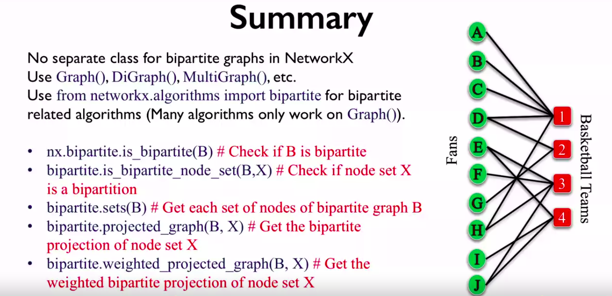</a>
</p>


