Applied Social Network Analysis in Python
=========================================

by University of Michigan

# Module 2
#
## Title: Network Connectivity

### Clustering Coefficient

#### Triadic Closure

* **Triadic Closure** is the tendency for people who share lots of connections, to form a connection themselves to become connected
	* So, people who share lots of friends have an increased likelihood of becoming connected themselves
* For example
	* let's say you have a network like shown in pic below, and you're asked, 
		* what edges are likely to come to the network next?
		* What edges are likely to arrive?
				<p align="center">
				  <a href="javascript:void(0)" rel="noopener">
				 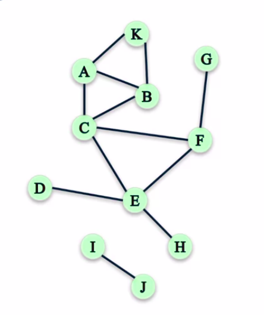</a>
				</p>
			* Triadic Closure would say that those edges that closed triangles are good candidates for edges that may show up next
				* So, here (shown in image below), all the red edges form closed triangles, and so, these are good candidates for edges that may show up
					<p align="center">
					  <a href="javascript:void(0)" rel="noopener">
					 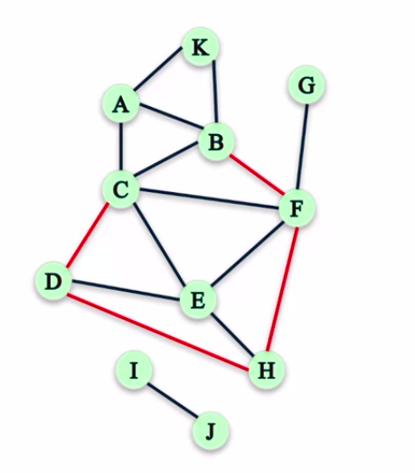</a>
					</p>
* Another way of referring to Triadic Closure is **Clustering**, and types are
	1. **Local Clustering Coefficient**
		* It is the fraction of pairs of the nodes friends that are friends with each other
		* For example
			1. Compute the Clustering Coefficient of node C (Refer image below)
				* What you would need to do is to take the ratio of the number of pairs of C's friends who are friends with each other, and the total number of pairs of C's friends
					<p align="center">
					  <a href="javascript:void(0)" rel="noopener">
					 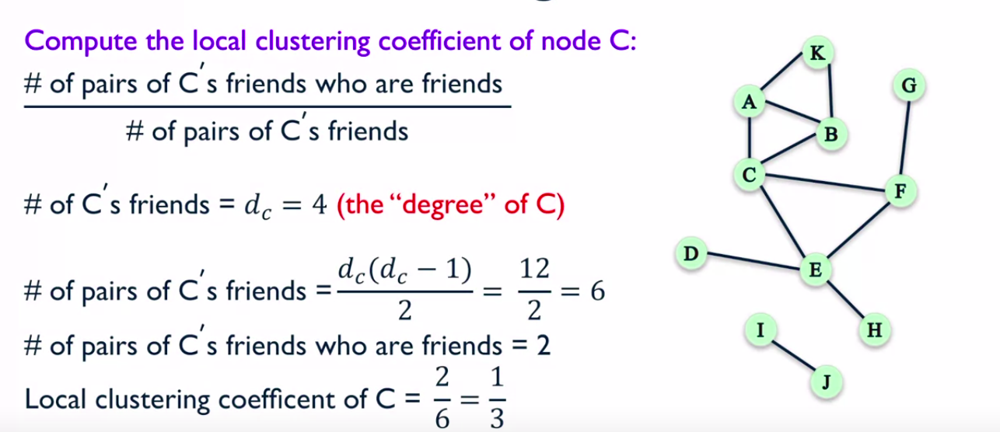</a>
					</p>
						* The Local Clustering Coefficient of node C is two over six or one-third. That means that one-third of all the possible pairs of friends of C who could be friends, are actually friends.
			1. Compute the Local Clustering Coefficient of node F (Refer image below)
				* We need to compute the ratio of the number of pairs of F's friends who are friends with each other, and the total number of pairs of F's friends
					<p align="center">
					  <a href="javascript:void(0)" rel="noopener">
					 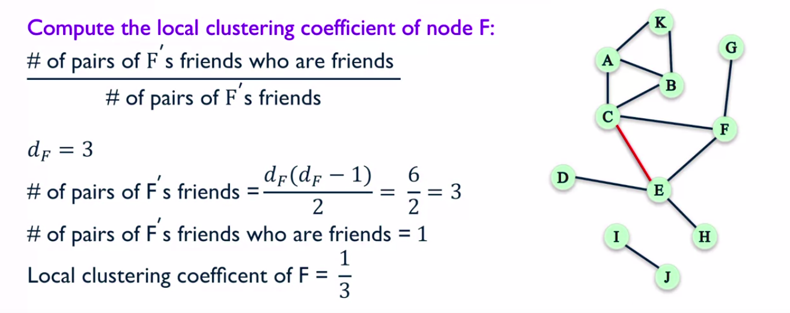</a>
					</p>
						* the Local Clustering Coefficient of F is also one-third
			1. Compute the Local Clustering Coefficient of node J (Refer image below)
				* We need to compute the ratio of the number of pairs of J's friends who are friends with each other, and the total number of pairs of J's friends
					<p align="center">
					  <a href="javascript:void(0)" rel="noopener">
					 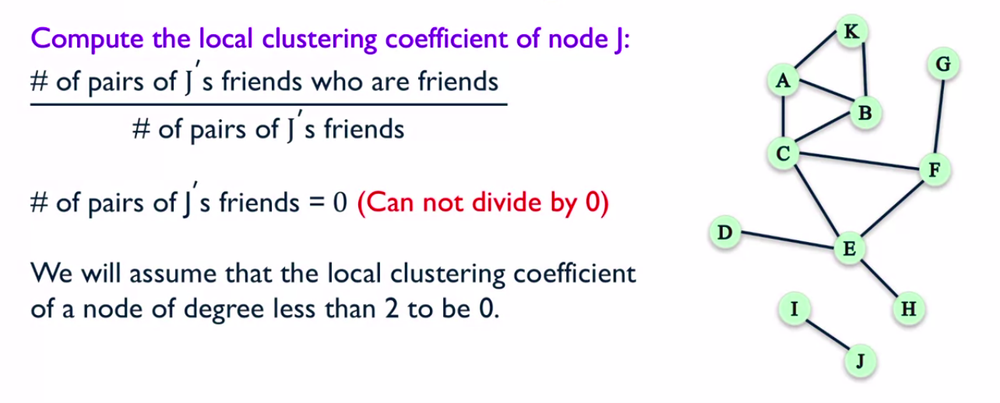</a>
					</p>
						* node J has only one friend which is node I, which means that J actually has zero pairs of friends
							* because that's what we're supposed to put in the denominator, we're in trouble because we cannot divide by zero
							* what we're going to do for cases like this is we're going to **assume** that nodes that **have less than two friends** have a **Local Clustering Coefficient** of **zero**
		* Implementation using NetworkX
			<p align="center">
			  <a href="javascript:void(0)" rel="noopener">
			 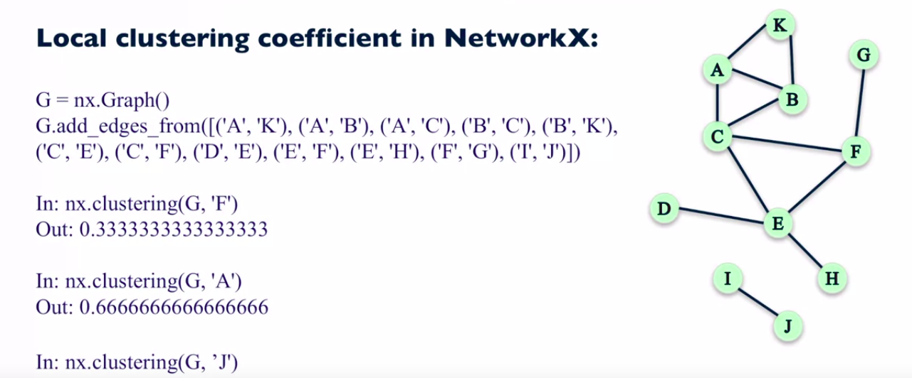</a>
			</p>
	1. **Global Clustering Coefficient**
		* Measuring clustering on whole network
			1. Approach 1 - **Average Local Clustering Coefficient** over all the nodes in the graph
				```python
				>>> nx.average_clustering(G)
					0.28787878787878785
				```
			1. Approach 2 ( __Transitivity__ ) - Percentage of "open triads" that are triangles in a network
				* **Triangles** are simply three nodes that are connected by three edges
				* **Open Triads** are three nodes that are connected by only two edges
					* A __triangle__ actually __contains__ __three__ different __open triads__
						<p align="center">
						  <a href="javascript:void(0)" rel="noopener">
						 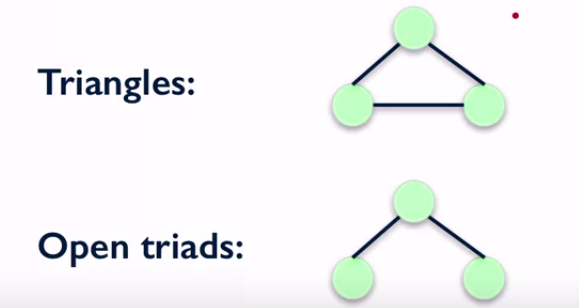</a>
						</p>
				* **Transitivity** 
					* **Transitivity** is Ratio of number of triangles and number of "open triads" in a network
					* Formula
						* Transitivity = ( 3 * Number of closed triads i.e triangles ) / Number of open triads
							<p align="center">
							  <a href="javascript:void(0)" rel="noopener">
							 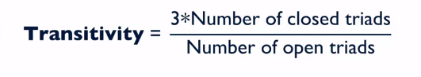</a>
							</p>
						```python
						>>> nx.transitivity(G)
							0.409090909091
						```
							<p align="center">
							  <a href="javascript:void(0)" rel="noopener">
							 </a>
							</p>
		* Transitivity vs Average Local Clustering Coefficient
			* They both try to measure the tendency for the edges to form triangles
			* **Transitivity** weights the nodes with a larger number of connections higher
				* It weights the nodes with a larger degree higher
			* For Example
				* Check out the graph presented in Image below
					* If you look at this graph closely, you'll find that most nodes actually have a pretty high Local Clustering Coefficient
					* So, all the nodes that are on the outside of the wheel have a **Local Clustering Coefficient** of **one** because, each one of these nodes, you see that it has two connections
						* So, it has one pair friends, and that pair friend is connected. So, this node here has a Local Clustering Coefficient of one and the same is true for all the nodes on the outside of the wheel.
			 		* So, most nodes have a high Local Clustering Coefficient
							<p align="center">
							  <a href="javascript:void(0)" rel="noopener">
							 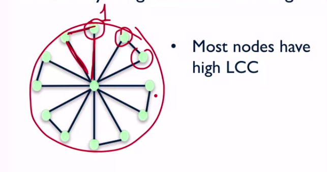</a>
							</p>
					* However, if you consider the node inside the wheel, the central node there, that one has a pretty high degree but it has a very low Clustering Coefficient
						* That is because it has many, many connections in many pairs of connections and only a few of those are actually connected to each other. But, most of them are not connected
						* So, in this graph (shown in image below), the average Clustering Coefficient is pretty high, it's 0.93 because most nodes have a very high Local Clustering Coefficient, except for one
							* However, the Transitivity of this network is 0.23. And that's because Transitivity weights the nodes with high degree higher
							* And so, in this network, there's one node with a very high degree compared to the others that has a very small Local Clustering Coefficient compared to the others, and Transitivity penalizes that. So, you get a much lower Transitivity
								<p align="center">
								  <a href="javascript:void(0)" rel="noopener">
								 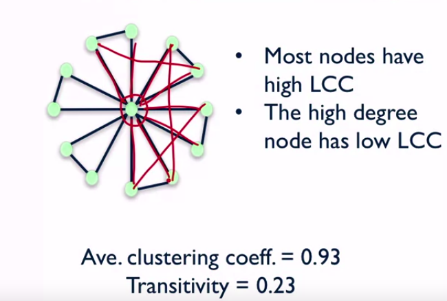</a>
								</p>
					* In Network displayed in image below,
						* In this network most nodes have a very low Local Clustering Coefficient
							* So, each one of these outer nodes here has a Local Clustering Coefficient of zero because they either have only one friend or they have two friends but those two are not connected. And, there are 15 nodes like that
								* The nodes inside, there are only five nodes like that and they have high degree, and then they have high Local Clustering Coefficient
								* when you look at the average Clustering Coefficient and Transitivity, you find that the average Local Clustering Coefficient of this network is pretty low because most nodes, the 15 outer nodes, have very low Local Clustering Coefficient
							* However, the Transitivity is high because the nodes with high degree happen to have high Local Clustering Coefficient
								<p align="center">
								  <a href="javascript:void(0)" rel="noopener">
								 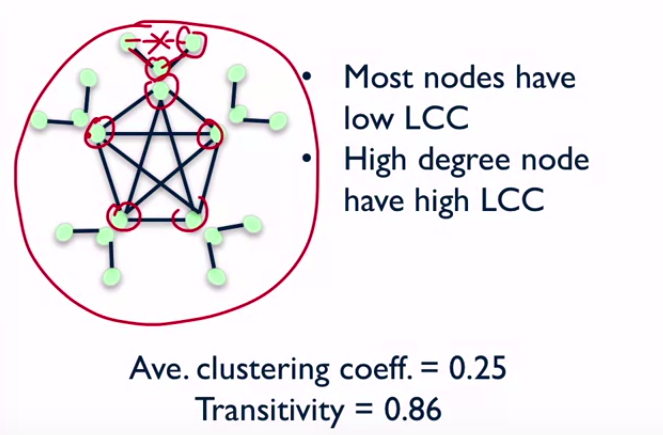</a>
								</p>

##### Summary

<p align="center">
  <a href="javascript:void(0)" rel="noopener">
 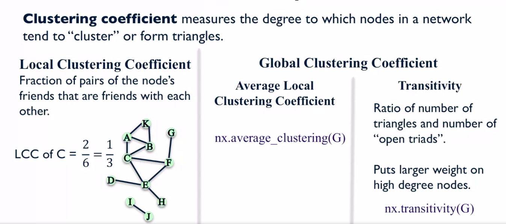</a>
</p>


### Distance Measures

* **Paths**
	* A Path is simply a sequence of nodes that are connected by an edge
* **Path Lenght**
	* Number of steps it contains from the beginning to the end
		<p align="center">
		  <a href="javascript:void(0)" rel="noopener">
		 </a>
		</p>
* **Distance between two Nodes**
	* The length of the shortest possible path between the two nodes
		```python
		>>> # To find the distance between nodes A and H
		>>> nx.shortest_path(G, 'A', 'H')
			['A', 'B', 'C', 'E', 'H']
		>>> # To find the length of distance between nodes A and H
		>>> nx.shortest_path_length(G, 'A', 'H')
			4
		```
			<p align="center">
			  <a href="javascript:void(0)" rel="noopener">
			 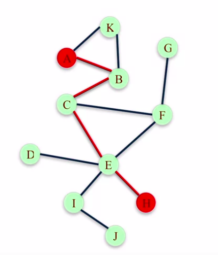</a>
			</p>
* Finding a distance from a particular Node to every other nodes
	1. **Breadth-first Search**
		* It is a systematic and efficient procedure for computing distances from a node to all other nodes in a large network by "discovering" nodes in layers
		* Example
			*  In the network shown (left hand side of image) in image below, we're interested in figuring out the distance from node A to all the other nodes in the network
				* we're going to start at A and we're going to start discovering new nodes as we kind of walk through this network. And we're going to be writing down all the nodes that we discover
				* So we start at A and we sort of process the node A by looking at who is connected to A
					* In this case, K and B are connected to A and so those are going to be a distance one away because they're the shortest path from each one of those nodes to A it's just one hop
				* now we're going to process each one of the newly discovered nodes and ask which nodes are connected to this newly discovered node that we haven't discovered yet? And those nodes are going to be assigned to the next layer
				* and so on... this process continues till nothing is left to parse
				* Check right hand side graph in image shown below, to see how this process works
						<p align="center">
						  <a href="javascript:void(0)" rel="noopener">
						 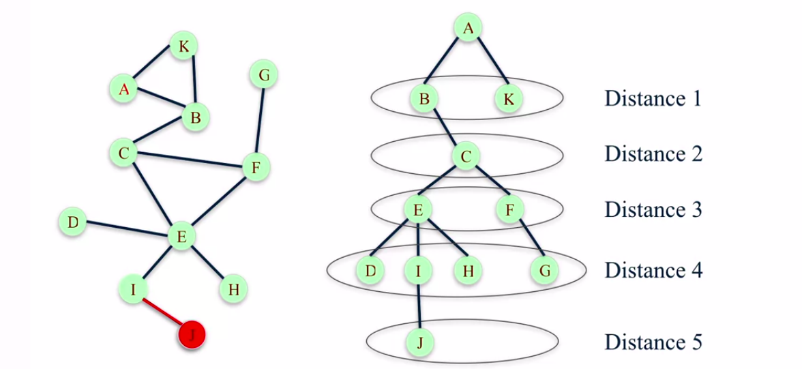</a>
						</p>
					```python
					>>> T = nx.bfs_tree(G, 'A')
					>>> T.edges()
						OUTPUT SHOWN IN IMAGE BELOW
					>>> nx.shortest_path_length(G, 'A')
						OUTPUT SHOWN IN IMAGE BELOW
					```
						<p align="center">
						  <a href="javascript:void(0)" rel="noopener">
						 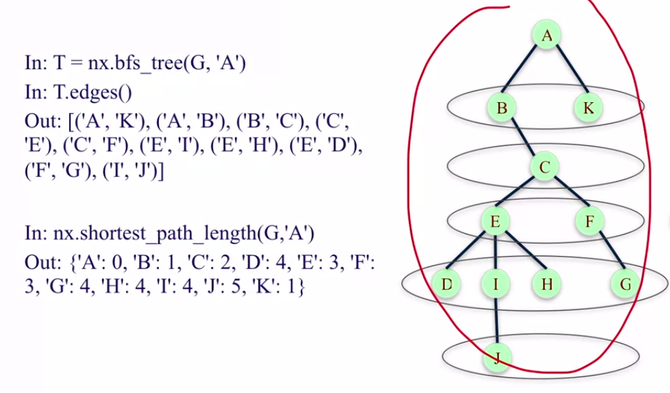</a>
						</p>
* How to characterize the distance between all pairs of nodes in a graph?
	1. **Average Distance** between every pair of nodes in the network
		```python
		>>> nx.average_shortest_path_length(G)
			2.527272727
		>>> # This means, that on average any pair of nodes in this graph are a distance 2.53 from each other
		```
	1. **Diameter** - Maximum distance between any pair of nodes in the network
		```python
		>>> nx.diameter(G)
			5
		```
* How to summarize the distances between all pairs of nodes in a graph?
	1. **Eccentricity** of a node **n** is the largest distance between **n** and all other nodes.
		```python
		>>> nx.eccentricity(G)
			OUTPUT SHOWN IN IMAGE
		```
			<p align="center">
			  <a href="javascript:void(0)" rel="noopener">
			 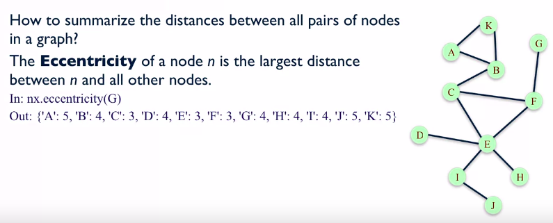</a>
			</p>
	1. **Radius** - The radius of graph	is the minimum eccentricity in the network
		```python
		>>> nx.radius(G)
			3
		```
	1. **Periphery** - The Periphery of a graph is the set of nodes in the graph that have eccentricity equal to the diameter
		* These nodes tend to be sort of on the outskirts of the network far away from all the other nodes
			```python
			>>> nx.periphery(G)
				['A', 'K', 'J']
			```
	1. **Center** - The Center of the graph is the set of nodes that have eccentricity equal to the radius
		```python
		>>> nx.center(G)
			['C', 'F', 'E']
		```
* Example
	* Check the image
		<p align="center">
		  <a href="javascript:void(0)" rel="noopener">
		 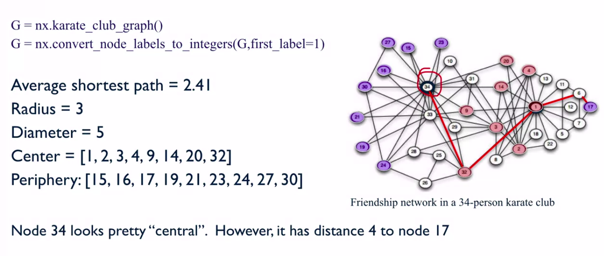</a>
		</p>

##### Summary

<p align="center">
  <a href="javascript:void(0)" rel="noopener">
 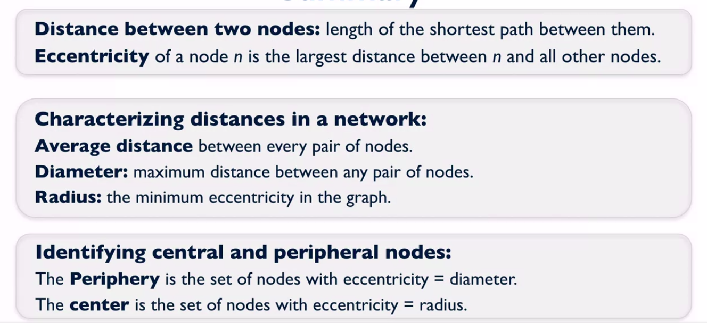</a>
</p>


### Connected Components

#### Connected Graphs

* Undirected Graphs
	1. An **undirected graph** is said to be **connected** if, for every pair of nodes, there is a path between the two nodes
		```python
		>>> nx.is_connected(G)
			True
		```
		* For example
			* Check the image below
					<p align="center">
					  <a href="javascript:void(0)" rel="noopener">
					 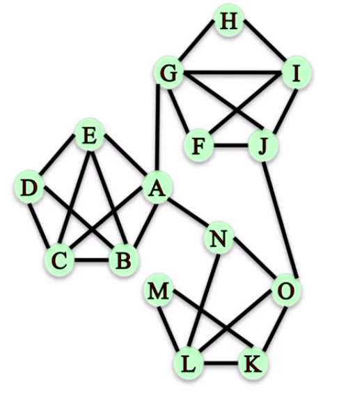</a>
					</p>
				* However, if we remove edges A-G, A-N and J-O, then the graph becomes disconnected, check image below
						<p align="center">
						  <a href="javascript:void(0)" rel="noopener">
						 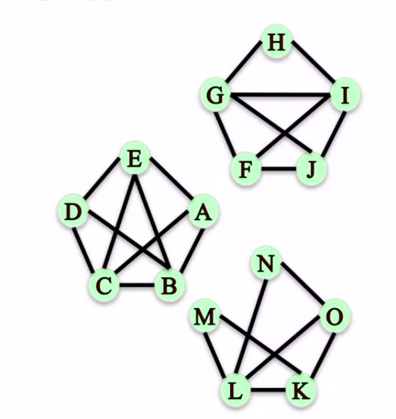</a>
						</p>
					* There is no path between nodes in the three different "communities", we're going to refer to these communities as **connected components**
						<p align="center">
						  <a href="javascript:void(0)" rel="noopener">
						 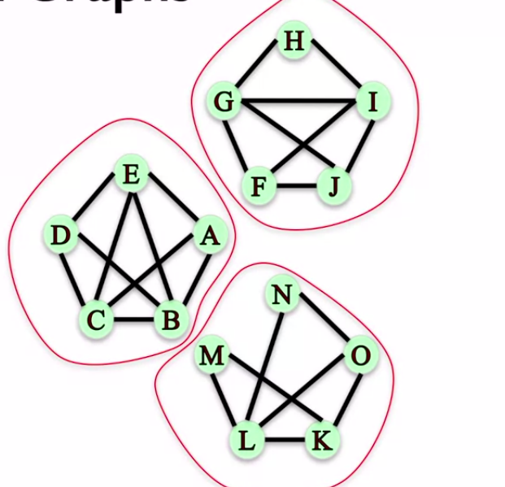</a>
						</p>
	* **Connected Components**
			<p align="center">
			  <a href="javascript:void(0)" rel="noopener">
			 </a>
			</p>
		* A __connected component__ is a subset of nodes such that there are two conditions this set of nodes satisfy
			1. Every node in the subset has to have a path to every other node in the subset
			1. No other node outside of the subset has a path to any node inside the subset
				* So condition two kind of makes sure that you get all the nodes that you could possibly can so that every node in this subset has a connection to every other node in the subset, not a subset of the subset that you could potentially get
		* For Example (Refer to the image above)
			1. Is the subset of nodes {E, A, G, F} a connected component?
				* We can clearly see that this is not a connected component because the nodes, A and F, cannot reach each other. There is no path going from A to F, so **condition number one fails**
				* Therefore, this is not a connected component
			1. Is the subset of nodes {N, O, K} a connected component?
				* In this case, condition number one is actually met
					* There is a path from any node in N, O, K to any other node in N, O, K
						* For example, if you wanted to find a path from N to K, you would go N-O-K
				* **Condition number two fails** because there are other nodes that can actually reach nodes in the subset
					* For example, L can actually reach N, O and K, there is a path from L to all three of those nodes
				* Therefore, this is not a connected component
		* {A, B, C, D, E}, {F, G, H, I, J}, {K, L, M, N, O}
			* These three communities such that every node is connected within and no nodes are connected across
			* These are the three connected components in this particular graph (Graph image shown above in this section)
		* Using NetworkX
			```python
			>>> # Find the connected components of an undirected graph by using the function number_connected_components and give it, 
			>>> #     the graph, its input and it would tell you how many
			>>> nx.number_connected_components(G)
				3
			>>> 
			>>> # To check which ones are the actual components
			>>> sorted(nx.connected_components(G))
				[{A, B, C, D, E}, {F, G, H, I, J}, {K, L, M, N, O}]
			>>> 
			>>> # To check which connected component a particular node belongs to, in this case we are checking 'M'
			>>> nx.node_connected_component(G, 'M')
				{K, L, M, N, O}
			```
* Directed Graphs
	1. A **directed graph** is **strongly connected** if, for every pair of nodes __u__ and __v__, there is a directed path that goes from __u__ to __v__ and then another directed path that goes from __v__ to __u__
			<p align="center">
			  <a href="javascript:void(0)" rel="noopener">
			 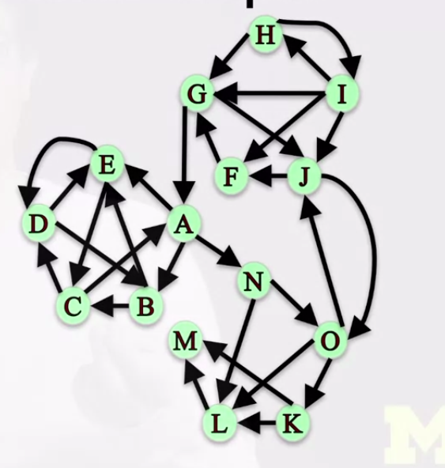</a>
			</p>
		* That, if a directed graph has a has a property, then we say it's strongly connected
		* Using NetworkX
			* It is **False** because there is no path that goes from A to H. therefore, this graph is not strongly connected.
				```python
				>>> nx.is_strongly_connected(G)
					False
				```
	1. A **directed graph** is **weakly connected** if, replacing all directed edges with undirected edges produces a connected undirected graph
			<p align="center">
			  <a href="javascript:void(0)" rel="noopener">
			 </a>
			</p>
		* Once the directed edges are replaced with undirected edges, we ask the question that you already applied to undirected graphs, is this graph connected or not?
			* If it is, then we say that the original directed graph is **weakly connected**
		* Using NetworkX
			```python
			>>> nx.is_weakly_connected(G)
				True
			```
				* This graph is weakly connected because once you turn it into an undirected graph, this undirected graph is connected
	* **Connected Components**
		1. **Strongly Connected Components** is a subset of nodes such that there are two conditions this set of nodes satisfy
				<p align="center">
				  <a href="javascript:void(0)" rel="noopener">
				 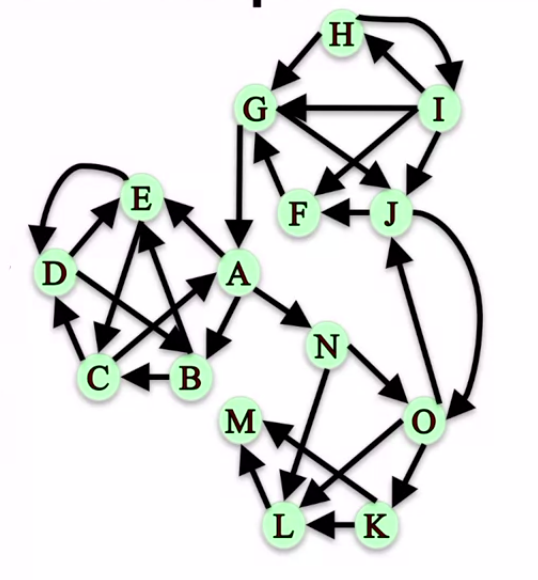</a>
				</p>
			1. Every node in the subset has to have a __directed__ path to every other node in the subset
			1. No other node outside of the subset has a __directed__ path to and from every node inside the subset
			* What are the strongly connected components of this graph?
				* Using NetworkX
					```python
					>>> sorted(nx.strongly_connected_components(G))
						[{M}, {L}, {K}, {A,B,C,D,E,F,G,J,N,O}, {H,I}]
					```
						<p align="center">
						  <a href="javascript:void(0)" rel="noopener">
						 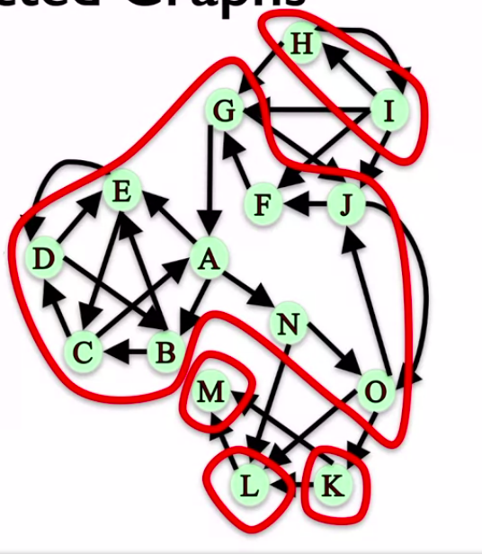</a>
						</p>
		1. **Weakly Connected Components** 
			* The connected components of the graph after replacing all directed edges with undirected edges
				* Then we would find the connected components in the new undirected graph
				* This graph is weakly connected, that means that when you make all the direct edges undirected, it becomes a connected graph
				* Then this particular graph has only one weakly connected component, which is the whole graph
					<p align="center">
					  <a href="javascript:void(0)" rel="noopener">
					 </a>
					</p>
			* Using NetworkX
				```python
				>>> sorted(nx.weakly_connected_components(G))
					[{'A','B','C','D','E','F','G','H','I','J','K','L','M','N','O'}]
				```
* Question
		<p align="center">
		  <a href="javascript:void(0)" rel="noopener">
		 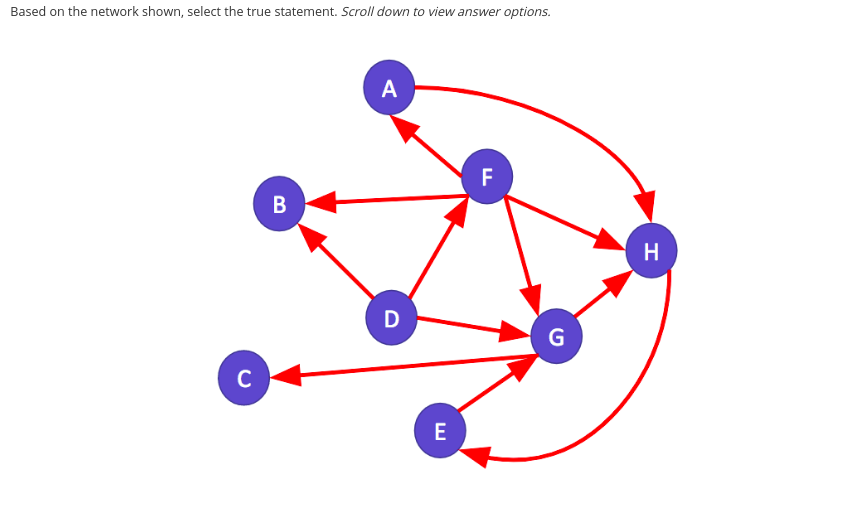</a>
		</p>
	* The network is weakly connected but not strongly connected
		* The network is not strongly connected since some pairs of nodes do not have a path connecting them. For example, there is no path from node C to node D.
			* However, the network is weakly connected because replacing all directed edges with undirected edges produces a connected undirected graph

##### Summary

<p align="center">
  <a href="javascript:void(0)" rel="noopener">
 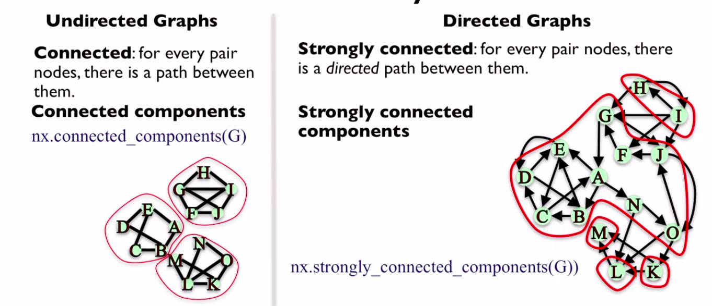</a>
</p>


### Network Robustness

* **Network Robustness** - The ability of a network to maintain its general structure properties when it faces failures or attacks
* Type of attacks
	* Removal of nodes or edges
		* This could be somebody purposely trying to remove a node or an edge from a network, or maybe, just random failures that the network may have
* Structural Properties
	* Connectivity
* **Network Robustness** is network's ability to maintain its connectivity, when it loses some of its nodes or some of its edges
	* Example
		1. Air Transportation Network
			* where the nodes are airports and the edges are connections between airports
			* sometimes airports have to close down for many different reasons
				* when this happens, transportation is affected. So you would like for the transportation network to be robust to closures of airports, so that the general connectivity or the general function of the network is still maintained even after it might have lost one particular airport
				* Or maybe it's not an airport, maybe it's a connection between an airport or some other airport. Maybe both airports are open but they're not able to fly to each other for whatever reason
					* That is the case where the network might have lost an edge rather than a node, and you would like for the network to still maintain its connectivity or functions
		1. Internet Router Failures
		1. Power Line Failure
* **Disconnecting a Graph**
	* What is the smallest number of **nodes** that can be **removed** from this graph in order in order to make it **disconnected**?
			<p align="center">
			  <a href="javascript:void(0)" rel="noopener">
			 </a>
			</p>
		```python
		>>> nx.node_connectivity(G_un) # G_un -> Undirected Graph
			1
		```
		* It means, if we just remove one node, we would be able to disconnect the graph completely
		* To check, Which node we need to remove to disconnect the graph completly?
			```python
			>>> nx.minimum_node_cut(G_un)
				{'A'}
			```
	* What is the smallest number of **edges**, that we would need to **remove** from this graph in order to completely **disconnect** it?
			<p align="center">
			  <a href="javascript:void(0)" rel="noopener">
			 </a>
			</p>
		```python
		>>> nx.edge_connectivity(G_un) # G_un -> Undirected Graph
			2
		```
		* It means, if we just remove 2 edges, we would be able to disconnect the graph completely
		* To check, Which edge we need to remove to disconnect the graph completly?
			```python
			>>> nx.minimum_edge_cut(G_un)
				{('A', 'G'), ('O', 'J')} # There can be more options to remove for edges, there maybe other pair of edges that can achieve same output
			```
* **Robust Networks** are those that have a large minimum node and edge cuts, i.e. those for which you would have to remove a lot of nodes or edges in order to be able to disconnect them
* **Simple Path**
	* For Node Connectivity
		* For Example
			1. Node 'G' wants to send a message to node 'L' by passing it along to other nodes in this network
				* What options does 'G' have to deliver the message?
					```python
					>>> sorted(nx.all_simple_paths(G, 'G', 'L'))
						[['G','A','N','L'],
						['G','A','N','O','K','L'],
						['G','A','N','O','L'],
						['G','J','O','K','L'],
						['G','J','O','L',]]
					```
						<p align="center">
						  <a href="javascript:void(0)" rel="noopener">
						 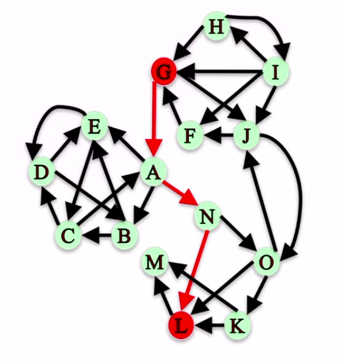</a>
						</p>
			1. If we wanted to block the message from G to L by removing nodes from the network, how many nodes would we need to remove?
				```python
				>>> nx.node_connectivity(G, 'G', 'L') # G_un -> Undirected Graph
					2
				```
				* It means, if we just remove 2 nodes, to block communication between G and L
				* To check, Which node we need to remove to achieve this?
					```python
					>>> nx.minimum_node_cut(G, 'G', 'L')
						{'N', 'O'}
					```
	* For Edge Connectivity
		* For Example
			1. If we wanted to block message from G to L by removing edges from the network, how many edges would we need to remove?
				```python
				>>> nx.edge_connectivity(G, 'G', 'L') # G_un -> Undirected Graph
					2
				```
				* It means, if we just remove 2 edges, to block communication between G and L
				* To check, Which edge we need to remove to achieve this?
					```python
					>>> nx.minimum_edge_cut(G, 'G', 'L')
						{('A','N'), ('J','O')}
					```
						<p align="center">
						  <a href="javascript:void(0)" rel="noopener">
						 </a>
						</p>

##### Summary 

<p align="center">
  <a href="javascript:void(0)" rel="noopener">
 </a>
</p>

