Applied Social Network Analysis in Python
=========================================

by University of Michigan

# Module 3
#
## Title: Influence Measures and Network Centralization

### Degree and Closeness Centrality

* **Node Importance**
		<p align="center">
		  <a href="javascript:void(0)" rel="noopener">
		 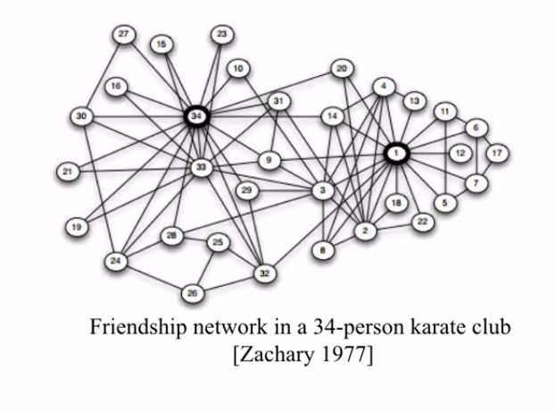</a>
		</p>
	* Based on the structure of this network, which would you say are the five most important nodes in this network?
		* Different ways to think about __importance__ are
			1. Nodes who have a very **high degree**, nodes who have lots of friends are important nodes
				* Using the above definition, The five most important nodes are nodes 34, 1, 33, 3 and 2
					<p align="center">
					  <a href="javascript:void(0)" rel="noopener">
					 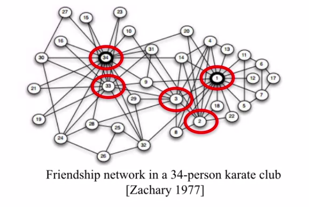</a>
					</p>
			1. Nodes who are important are nodes who are very close to other nodes and network, nodes who have **high proximity** to other nodes and network
				* Using the above definition, The five most important nodes in the network would be notes 1, 3, 34, 32 and 9
					<p align="center">
					  <a href="javascript:void(0)" rel="noopener">
					 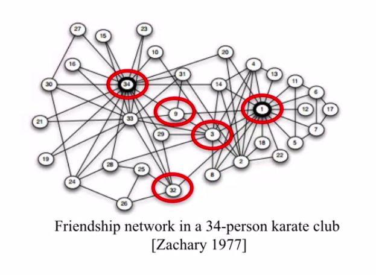</a>
					</p>
			1. Nodes who are important are nodes who tend to connect other nodes into network. So, we could imagine measuring importance by the **fraction of shortest paths** that pass through a particular node
				* Using the above definition, The five most important nodes in the network are nodes 1,34, 33, 3 and 32
					<p align="center">
					  <a href="javascript:void(0)" rel="noopener">
					 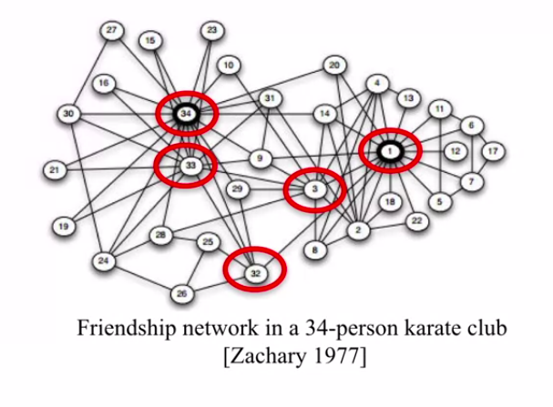</a>
					</p>
* **Network Centrality**
	* **Centrality Measures** identify the most important nodes in a network, 
		* Cases in which we would want to use this technique is when we want to find most:
			1. Influential Nodes in a social network
			1. Nodes that dissiminate information to many nodes or prevent epidemics
			1. Hubs in a transportation network
			1. Important pages on the Web
			1. Nodes that prevent the network from breaking up
	* __Centrality Measures__ that are __commonly__ used are:
		1. __Degree Centrality__
		1. __Closeness Centrality__
		1. __Betweenness Centrality__
		1. __Load Centrality__
		1. __Page Rank__
		1. __Katz Centrality__
		1. __Percolation Centrality__
* __Degree Centrality__
	* **Assumption** is that important nodes have many connections
	* The most basic measure of centrality: Number of Neighbors
	* Depending on the type of network we will have to use different degree
		* **Undirected Network** : We can simple use degree
				<p align="center">
				  <a href="javascript:void(0)" rel="noopener">
				 </a>
				</p>
			* A node would have a __centrality__ of __one (1)__ if it's connected to every single node in the network
			* A node would have a __centrality__ of __zero (0)__ if it's connected to no node in the network
			* Formula
				<p align="center">
				  <a href="javascript:void(0)" rel="noopener">
				 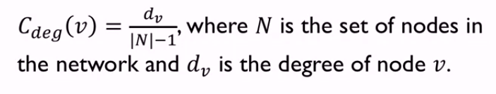</a>
				</p>
			* This measure goes between zero (0) and one (1), with one being the case where you're most connected.
			* Using NetworkX
				```python
				>>> G = nx.karate_club_graph()
				>>> 
				>>> G = nx.convert_node_labels_to_integers(G, first_label=1) # Converting node labels to integers, so that it matches the image
				>>> degCent = nx.degree_centrality(G) # Output if Dict type
				>>> degCent[34]
					0.515  # 17/33 cz node 34 has 17 connections and |N| = 34
				>>> degCent[33]
					0.364 # 12/33 cz node 33 has 12 connections and |N| = 34
				```
		* **Directed Network** : We use either in-degree or out-degree or combination of both
				<p align="center">
				  <a href="javascript:void(0)" rel="noopener">
				 </a>
				</p>
			* Formula
				1. For using In-Degree Centrality in formula
						<p align="center">
						  <a href="javascript:void(0)" rel="noopener">
						 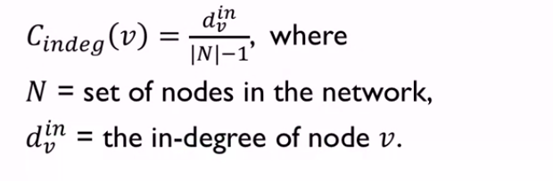</a>
						</p>
					* Using NetworkX
						```python
						>>> indegCent = nx.in_degree_centrality(G)
						>>> indegCent['A']
							0.143 # 2/14 cz 'A' has 2 in-degree nodes and |N|=15
						>>> indegCent['L']
							0.214 # 3/14 cz 'L' has 3 in-degree nodes and |N|=15 
						```
				1. For using Out-Degree Centrality in formula
						<p align="center">
						  <a href="javascript:void(0)" rel="noopener">
						 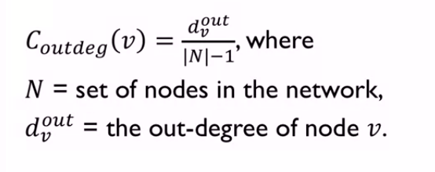</a>
						</p>
					* Using NetworkX
						```python
						>>> outdegCent = nx.out_degree_centrality(G)
						>>> outdegCent['A']
							0.214 # 3/14 cz 'A' has 3 out-degree nodes and |N|=15
						>>> outdegCent['L']
							0.071 # 1/14 cz 'L' has 1 in-degree nodes and |N|=15 
						```
* __Closeness Centrality__
		<p align="center">
		  <a href="javascript:void(0)" rel="noopener">
		 </a>
		</p>
	* **Assumption** is that nodes that are important are going to be a __short distance__ away from all other nodes in the network
	* Formula
		* It is defined as : the **closeness centrality of node V** is the **ratio** of the **number of nodes in the network minus one (1)** **divided** by the **sum over all the other nodes** in the network, and the **distance between node V and those nodes**
			<p align="center">
			  <a href="javascript:void(0)" rel="noopener">
			 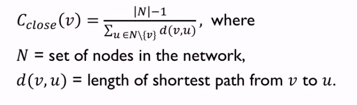</a>
			</p>
	* Using NetworkX
		```python
		>>> closeCent = nx.closeness_centrality(G)
		>>> closeCent[32]
			0.541
		>>> # This is how we got 0.541 value. According to the formula discussed above
		>>> sum(nx.shortest_path_lenth(G, 32).values())
			61
		>>> (len(G.nodes())-1)/61
			0.541
		```
	* In case of **Disconnected Nodes**
			<p align="center">
			  <a href="javascript:void(0)" rel="noopener">
			 </a>
			</p>
		* That is, how to measure the closeness centrality of a node when it cannot reach all other nodes?
			1. **Option 1** : Consider only nodes that respective node (let's say L) can reach
				* Formula
					* It is defined as the **closeness centrality of L** is the ratio of the number of nodes that L can reach divided by the sum of the distances from L to all the nodes that L can actually reach
						<p align="center">
						  <a href="javascript:void(0)" rel="noopener">
						 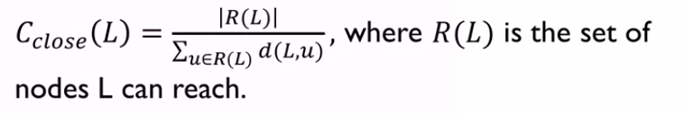</a>
						</p>
					* So, for node L here, this would be simply __one (1)__, because L can only reach node M, so R(L) here is just the {M} and L can reach M in just **one step**
						* This is one and this is the highest possible centrality a node can have in a network
							<p align="center">
							  <a href="javascript:void(0)" rel="noopener">
							 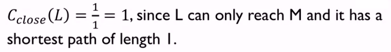</a>
							</p>
				* **Problem** : As node L can only reach one node and we're saying that it has the highest possible centrality that any node can have
			1. **Option 2** : Consider only the nodes that a respective node (let's say L) can reach and normalize by the fraction of nodes that a respective node (Let's say L) can reach
				* Formula
					* We will multiply that ratio (shown in __Option 1__), with the fraction of nodes that L can reach, R(L), divided by the number of nodes in the graph minus one (|N| - 1)
						* So basically, we're normalizing by the fraction of nodes that L can reach
							<p align="center">
							  <a href="javascript:void(0)" rel="noopener">
							 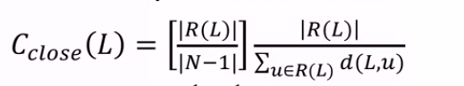</a>
							</p>
					* So, in this case if we do that we find that L has a closeness centrality of 0. 071 which is more reasonable than defined to be one
						<p align="center">
						  <a href="javascript:void(0)" rel="noopener">
						 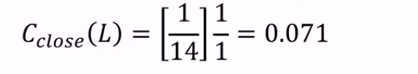</a>
						</p>
				* This definition can still apply even if the graph is completely connected
				* Using NetworkX
					```python
					>>> closeCent = nx.closeness_centrality(G, normalized=False)
					>>> closeCent['L']
						1
					>>> closeCent = nx.closeness_centrality(G, normalized=True)
					>>> closeCent['L']
						0.071
					```

##### Summary

<p align="center">
  <a href="javascript:void(0)" rel="noopener">
 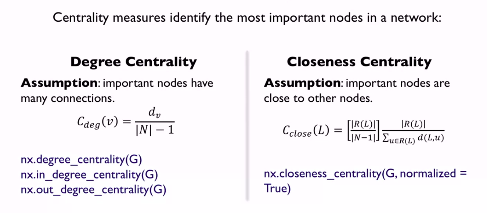</a>
</p>

### Betweenness Centrality

* **Assumption** is that important nodes are those who connect other nodes
* As we already know, the distance between two nodes is the length of the shortest path between them
	<p align="center">
	  <a href="javascript:void(0)" rel="noopener">
	 </a>
	</p>
* For Example
	* The distance between nodes 34 and 2 is 2
		* There are multiple ways of getting from node 34 to 2 in two steps, we can take path:
			1. 34 - 31 - 2
			1. 34 -14 - 2
			1. 34 - 20 - 2
		* Note that nodes 31, 14, and 20 are in the shortest paths between node 34 and 2
* What are the nodes that show up in the shortest paths between two different nodes?
* Formula
		<p align="center">
		  <a href="javascript:void(0)" rel="noopener">
		 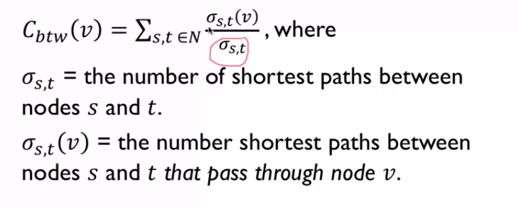</a>
		</p>
	* Basic idea here is that a node v has high betweenness centrality if it shows up in many of the shortest paths of nodes s and t
* **Endpoint** One of the option that we have is whether or not we include node v as node s and t in computation of C<sub>btw</sub>(v)
	<p align="center">
	  <a href="javascript:void(0)" rel="noopener">
	 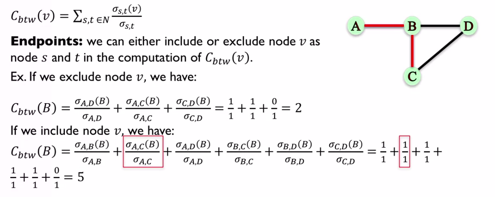</a>
	</p>
* Using NetworkX
	```python
	>>> G = nx.Graph()
	>>> G.add_edges_from([('A', 'B'), ('A', 'C'), ('B', 'C'), ('C', 'D'), ('D', 'E'), ('E', 'G'), ('E', 'G'), ('G', 'F'), ('E', 'F')])
	>>> 
	>>> betweennessCent = nx.betweenness_centrality(G, normalized = False, endpoints = False) # Excluding End-Points and Result is not Normalized
	>>> betweennessCent['D']
		9.0
	>>> betweennessCent # type(betweennessCent) is 'dictionary'
		{'A': 0.0, 'B': 0.0, 'C': 8.0, 'D': 9.0, 'E': 8.0, 'G': 0.0, 'F': 0.0}
	```
* In case of **Disconnected Nodes**
	* Sometimes some pairs of nodes are actually not connected to each other, they cannot reach each other
	* This tends to happen more often in graphs that are directed
		<p align="center">
		  <a href="javascript:void(0)" rel="noopener">
		 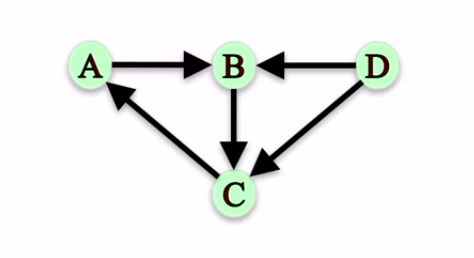</a>
		</p>
	* Example
		1. In image above, we can see that
			* Node D cannot be reached by any other node
			* Hence, sigma<sub>A,D</sub> = 0, making the formula below undefined
				<p align="center">
				  <a href="javascript:void(0)" rel="noopener">
				 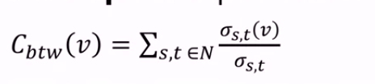</a>
				</p>
			* **`Therefore, when computing betweenness centrality, we only consider nodes s,t such that there is atleast one path between them`**
		1. What is the betweenness centrality of node B, without including it as endpoint?
				<p align="center">
				  <a href="javascript:void(0)" rel="noopener">
				 </a>
				</p>
			* Notice that you can also go from D to A passing through B. You can go D, B, C, A. But that is a longer path, so it's not the shortest path
				* so B is not involved in the shortest path between D and A
				* in this case, node B has a centrality of 1
		1. What is the betweenness centrality of node C, without including it as endpoint?
			* Node C has betweenness centrality of 2
				<p align="center">
				  <a href="javascript:void(0)" rel="noopener">
				 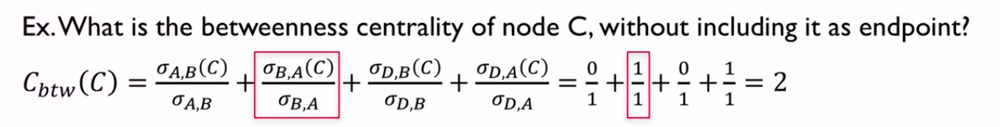</a>
				</p>
* **Normalization**
	* **Problem without Normalization**, is that nodes that are in graphs that have a larger number of nodes will tend to have higher centrality than nodes of graphs that are smaller in terms of the number of nodes
		* That's simply because in large graphs, there are more nodes, s and t, to choose from to compute the centrality of the nodes
	* Betweenness Centrality values will be larger in graphs with many nodes. **To control this**, we **divide centrality value by the number of pairs of nodes in the network (excluding v)**
		* We would divide the Betweenness Centrality of v by
			1. Undirected Graphs
				* (1/2) (|N| - 1) (|N| - 2)
					* That's the number of pairs that you could have in an undirected graph excluding the node that you're currently looking at
			1. Directed Graphs
				* (|N| - 1) (|N| - 2)
					* In directed graphs, you have twice the number of pairs because for any pair s, t, you could have a path from s to t, but also a potentially different path from t to s
	* Using NetworkX
		```python
		>>> G = nx.Graph()
		>>> G.add_edges_from([('A', 'B'), ('A', 'C'), ('B', 'C'), ('C', 'D'), ('D', 'E'), ('E', 'G'), ('E', 'G'), ('G', 'F'), ('E', 'F')])
		>>> 
		>>> betweennessCent = nx.betweenness_centrality(G, normalized = True, endpoints = False) # Excluding End-Points and Result is not Normalized
		>>> betweennessCent['D']
			0.6
		>>> betweennessCent # type(betweennessCent) is 'dictionary'
			{'A': 0.0, 'B': 0.0, 'C': 0.5333333333333333, 'D': 0.6, 'E': 0.5333333333333333, 'G': 0.0, 'F': 0.0}
		```
		<p align="center">
		  <a href="javascript:void(0)" rel="noopener">
		 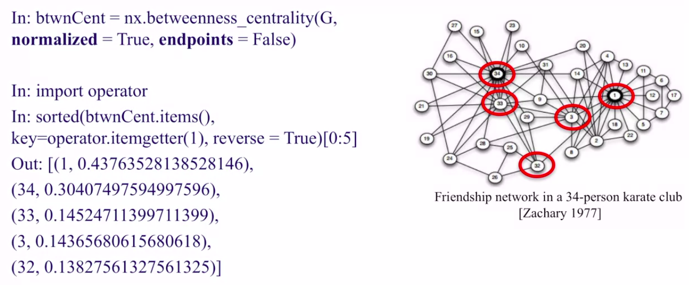</a>
		</p>
* **Complexity**
	* **Issue** : Computing betweenness centrality is that it can be very **computationally expensive**
	* Depending on the specific algorithm you're using, this computation can take up to 
		* O(|N|<sup>3</sup>) time
			<p align="center">
			  <a href="javascript:void(0)" rel="noopener">
			 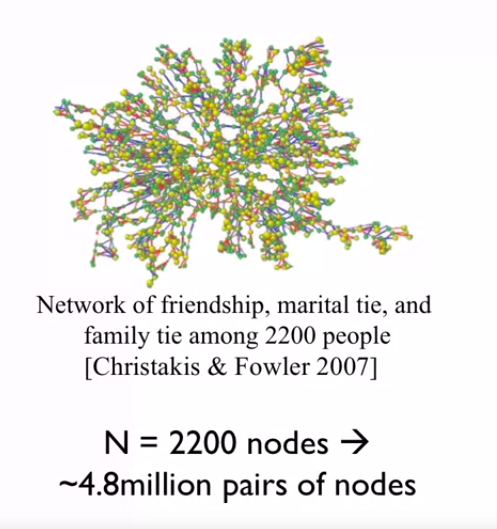</a>
			</p>
	* **Approximation** - So what we can do is
		* Rather than the computing betweenness centrality based on all the pair of nodes s,t, we can approximate it based on sample of nodes (instead of looking at all the nodes)
		* Using NetworkX
			```python
			>>> G = nx.Graph()
			>>> G.add_edges_from([('A', 'B'), ('A', 'C'), ('B', 'C'), ('C', 'D'), ('D', 'E'), ('E', 'G'), ('E', 'G'), ('G', 'F'), ('E', 'F')])
			>>> 
			>>> betweennessCent = nx.betweenness_centrality(G, normalized = True, endpoints = False, k=4) # Excluding End-Points and Result is not Normalized
			>>> # Parameter 'k' says how many nodes you should use to compute the betweenness centrality
			>>> # Value of 'k' should be positive and less than the population (i.e. total nodes in network)
			>>> # In this example total nodes are 7, so value of 'k' can be <= 7
			>>> 
			>>> betweennessCent['D']
				0.7
			>>> betweennessCent # type(betweennessCent) is 'dictionary'
				{'A': 0.0, 'B': 0.0, 'C': 0.5833333333333334, 'D': 0.7, 'E': 0.35, 'G': 0.0, 'F': 0.0}
			```
			<p align="center">
			  <a href="javascript:void(0)" rel="noopener">
			 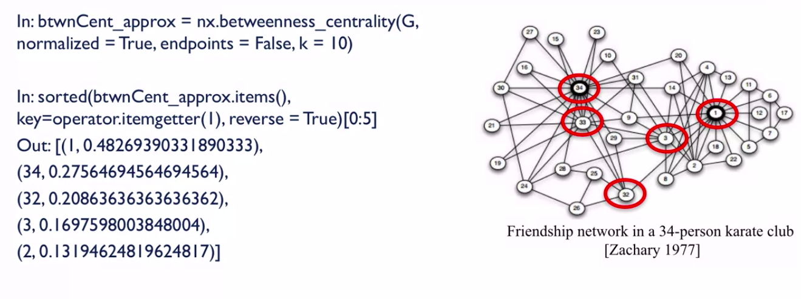</a>
			</p>
* **Subsets**
	* Sometimes is useful is that sometimes you rather compute the betweenness centrality based on two subgroups in the network, not necessarily looking at all potential pairs of nodes
		* But you maybe really care about two groups communicating with each other
		* So you want to find what are the most important nodes in this network that tend to show up in the shortest paths between a group of source nodes and a group of target nodes
	* Using NetworkX
		* when we select the nodes s, t to compute the centrality of all the nodes, we're always going to choose s from the set of source nodes, and t from the set of target nodes, rather than selecting all possible pairs
				<p align="center">
				  <a href="javascript:void(0)" rel="noopener">
				 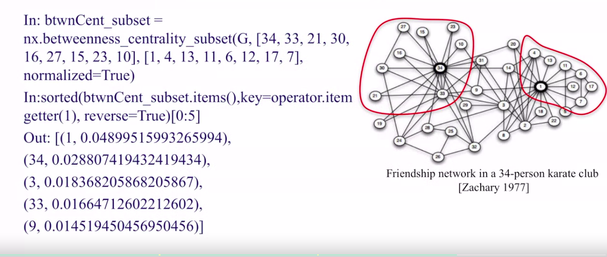</a>
				</p>
			* when we find the top nodes here with the highest betweenness centrality in this setup, with these source nodes and these target nodes, we find that nodes 1, 34, 3, 33, and 9 are the most important nodes
			* Notice that these tend to be the nodes that also have highest centrality when you don't restrict to source and subset of source and target nodes. But there are some changes
				* for example, we had not seen that node number 9 was important before. Now we see that it's important in connecting this particular sets of nodes
* **Edges**
	* Formula
		* the **betweenness centrality of edge e** is the ratio of the number of shortest paths in going from s to t that involve the edge e divided by all shortest paths between nodes s and t
			<p align="center">
			  <a href="javascript:void(0)" rel="noopener">
			 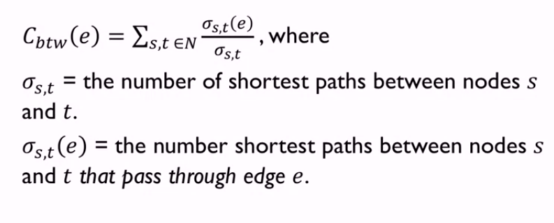</a>
			</p>
	* Using NetworkX
		```python
		>>> G = nx.Graph()
		>>> G.add_edges_from([('A', 'B'), ('A', 'C'), ('B', 'C'), ('C', 'D'), ('D', 'E'), ('E', 'G'), ('E', 'G'), ('G', 'F'), ('E', 'F')])
		>>> 
		>>> betweennessCent = nx.edge_betweenness_centrality(G, normalized = True, endpoints = False) # Excluding End-Points and Result is not Normalized
		>>> betweennessCent[('D', 'E')]
			0.5714285714285714
		>>> betweennessCent # type(betweennessCent) is 'dictionary' of pair of Nodes
			{('A', 'B'): 0.047619047619047616, ('A', 'C'): 0.23809523809523808, ('B', 'C'): 0.23809523809523808, ('C', 'D'): 0.5714285714285714, ('D', 'E'): 0.5714285714285714, ('E', 'G'): 0.23809523809523808, ('E', 'F'): 0.23809523809523808, ('G', 'F'): 0.047619047619047616}
		```
		<p align="center">
		  <a href="javascript:void(0)" rel="noopener">
		 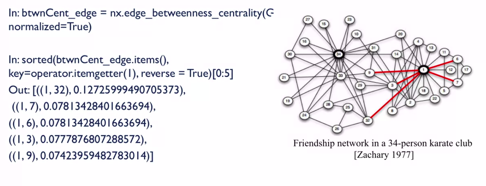</a>
		</p>
		<p align="center">
		  <a href="javascript:void(0)" rel="noopener">
		 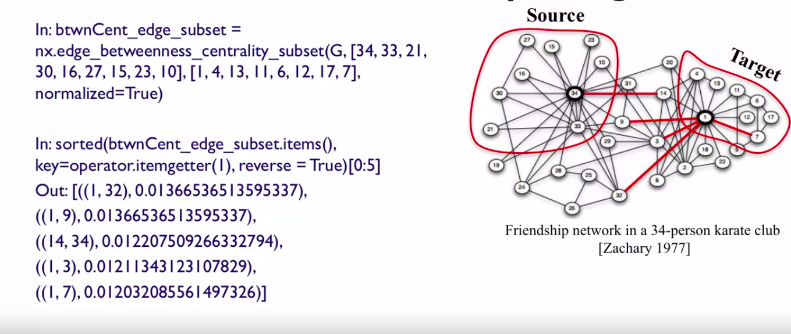</a>
		</p>

##### Summary

<p align="center">
  <a href="javascript:void(0)" rel="noopener">
 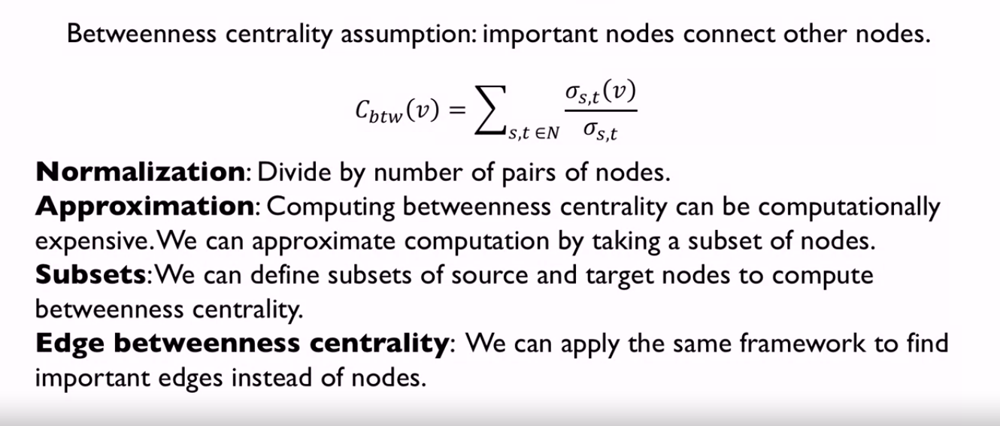</a>
</p>


### Basic Page Rank

* It was developed by the **Google founders** when they were thinking about how to measure the importance of webpages using the hyperlink network structure of the web
* **Page Rank** will assign a score of importance to every single node
	<p align="center">
	  <a href="javascript:void(0)" rel="noopener">
	 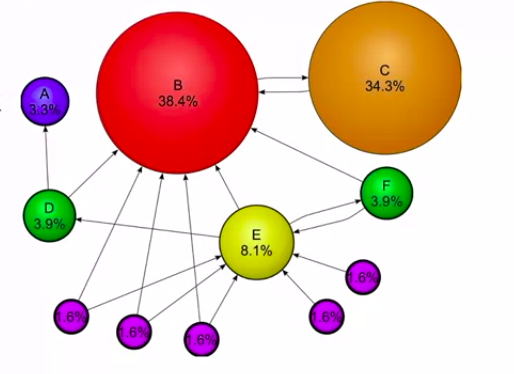</a>
	</p>
* **Assumption** is that important nodes are those that have many in-links from important pages or important other nodes.
* Page Rank can be used on any type of network, for example, the web or social networks, but it really works better for networks that have directed edges
	* For example
		* A social network where the edges indicate who emailed whom
* So what we will do is
	```ruby
	n = number of nodes in the network
	k = number of steps
    .
	1. Assign all nodes a PageRank of 1/n
	2. Perform the Basic PageRank Update Rule 'k' times
	```
	* __Basic PageRank Update Rule__ : Each node give an equal share of its current PageRank to all the nodes it links to
	* The new PageRank of each node is the sum of all the PageRank it received from other nodes
* Example
	* Calculating PageRank
		* Note that Even if we'll update the PageRank of a node, but when we do this computation, we'll always be using the old values, not the updated values
		* STEP 1 : k=1
			<p align="center">
			  <a href="javascript:void(0)" rel="noopener">
			 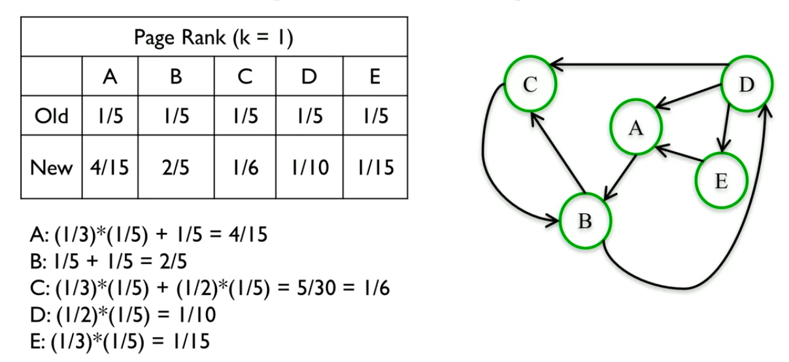</a>
			</p>
		* STEP 2 : k=2
			<p align="center">
			  <a href="javascript:void(0)" rel="noopener">
			 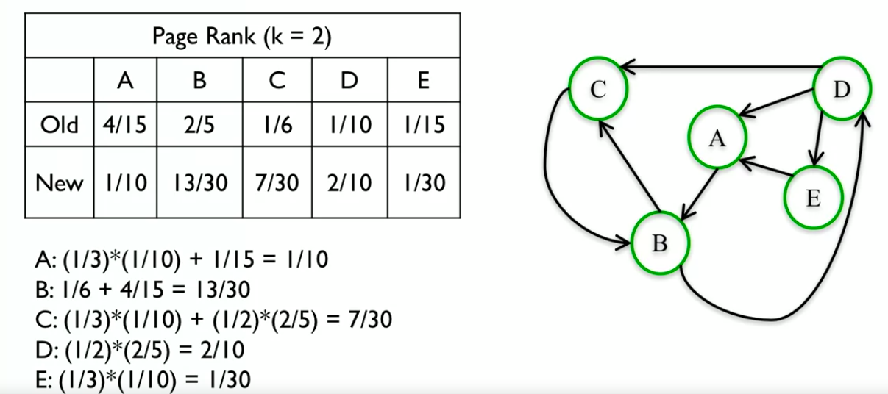</a>
			</p>
		* B is the most important node in this network as per the PageRank
			* Even for k=3, notice that the values change a little bit, but so far order is still same, i.e. B is still the most important node, followed by C, followed by D, followed by A, and followed by E
				<p align="center">
				  <a href="javascript:void(0)" rel="noopener">
				 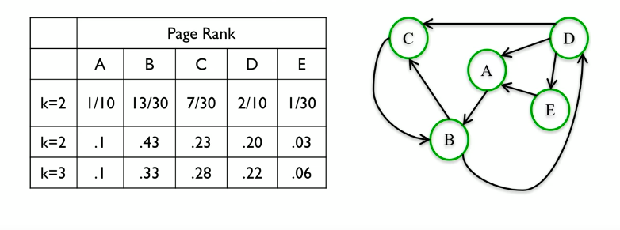</a>
				</p>
		* For this particular network, if you continue doing this over and over and do it for many, many, many steps, it turns out that eventually these values will start to change very little, so they're converging to a unique value
			* For most networks, these PageRank values will actually converge and that's the value that we think of as the PageRank of the nodes. So, the PageRank of the node is the value that you get after you do this process many, many, many times
				<p align="center">
				  <a href="javascript:void(0)" rel="noopener">
				 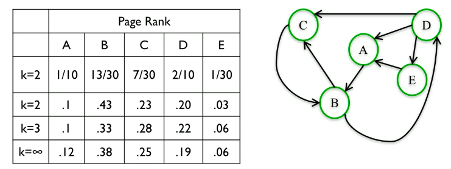</a>
				</p>

##### Summary

* Nodes with fewer in-degrees may have a high Page Rank when they are connected to a more important node
<p align="center">
  <a href="javascript:void(0)" rel="noopener">
 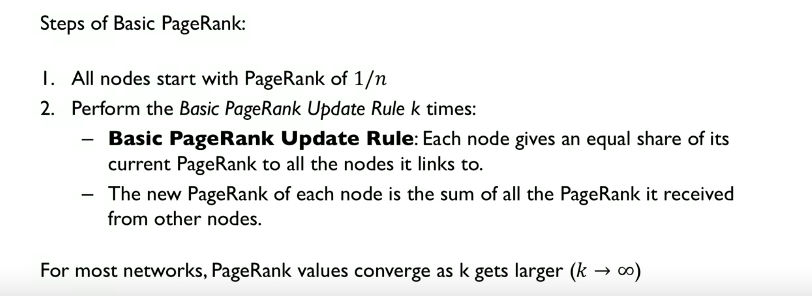</a>
</p>


### Scaled Page Rank

* **PageRank** value of a node after **k** steps can be interpreted as the **probability** that a **random walker** lands on that node after taking **k** random steps
* What is Random Walk of __k__ Steps
	1. Start on a random node
	1. Then Choose an outgoing edge at random, and
	1. follow it to the next node.
	1. Repeat __k__ times
	* Randomly choose edges and walk along in the network
* PageRank problem solution
	<p align="center">
	  <a href="javascript:void(0)" rel="noopener">
	 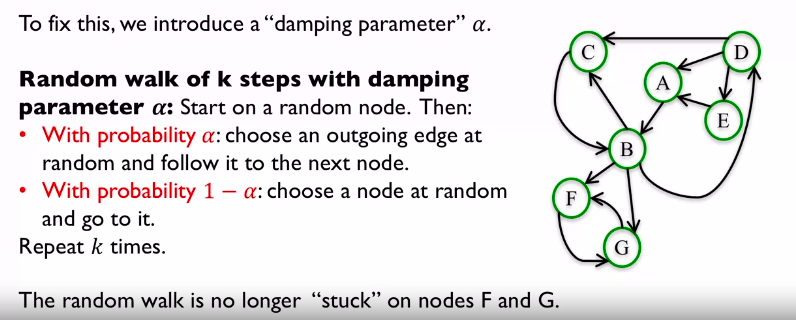</a>
	</p>
* **Scaled PageRank** of **k** steps with damping parameter **alpha** of a node **n** is the probability that a random walk with damping parameter **alpha** lands on a node **n** after **k** steps
	* For most networks, as **k** gets larger, Scaled PageRank converges to a unique value, which depends on **alpha**
	* That unique value will be dependent on the particular value of alpha that you choose
	* we choose our parameter alpha between 0.8 and 0.9. So most of the time, we're going to be following the edges
		* But sometimes, maybe 10 or 20% of the time, we're going to be jumping randomly, that way we're not stuck anywhere in the network
			<p align="center">
			  <a href="javascript:void(0)" rel="noopener">
			 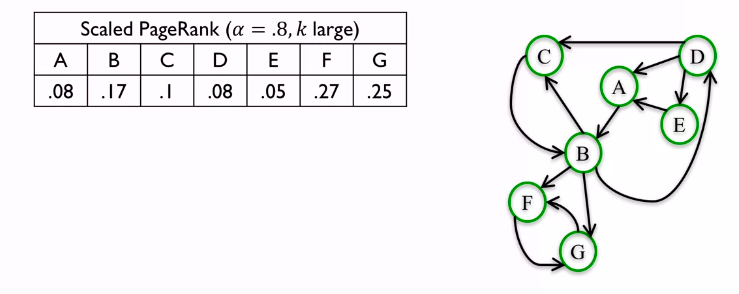</a>
			</p>
		* B still has the highest value of Scaled PageRank followed by C, followed by D and A, which roughly get the same value, and then followed by node E 
	* this damping parameter works better for large networks like the web or very large social networks
	* Using NetworkX
		* To compute Scaled PageRank of network G with damping parameter alpha
			```python
			>>> nx.pagerank(G, alpha=0.8)
			```


##### Summary

<p align="center">
  <a href="javascript:void(0)" rel="noopener">
 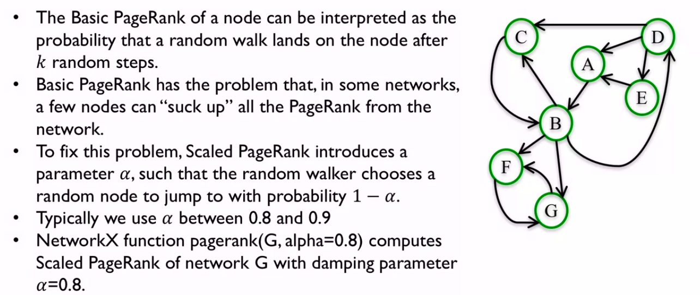</a>
</p>


### Hubs and Authorities

* This is one of the ways to find central nodes in the network
* This way was also developed in the context of how a search engine might go about finding important web pages given a query using the hyperlink structure of the web
	1. **Root** : set of highly relevant web pages. e.g. pages that contain the query string - Potential Authorities
	1. Find all the pages that link to a page in root - potential hubs
		* **Hub** : Hubs are pages that are not themselves necessarily relevant to the query that the user submitted, but they link to pages that are relevant
			* They're pages that are good at pointing at things that may be relevant.
	1. **Base** : root nodes and any node that links to a node in root
	1. Consider all the hyperlinks that link any node in the base set to any other node in the base set
		<p align="center">
		  <a href="javascript:void(0)" rel="noopener">
		 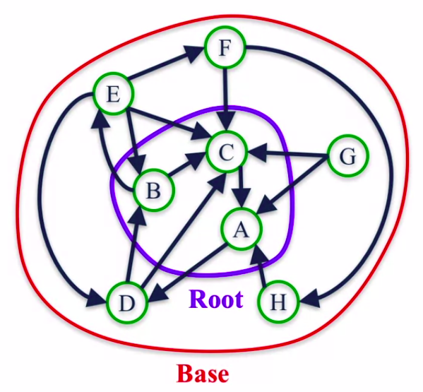</a>
		</p>
* Difference between this new way hubs and authorities and PageRank is that rather than taking the full network, we're starting with a subset of the network
* **HITS Algorithm**
	* Computing **k** iterations of the HITS algorithm to assign an authority score and hub score to each node
	* HITS algorithm is going to keep track of two kinds of scores for every node, 
		1. The Authority Score
		1. The Hub Score
	* Step 1: give every node an authority and a hub score of **1**
	* Step 2: then we're going to apply two different rules
		1. Apply the **Authority Update Rule**: Each node's **authority** score is the sum of **hub** scores of each node that **points to it**
		1. Apply the **Hub Update Rule**: Each node's **hub** score is the sum of **authority** scores of node that **it points to**
	* **Normalize** Authority and Hub Scores
		 * The way you normalize the authority score is you take each node's authority score, let's say j, and you divide the authority score of j by the sum of all the authorities in the whole network
			<p align="center">
			  <a href="javascript:void(0)" rel="noopener">
			 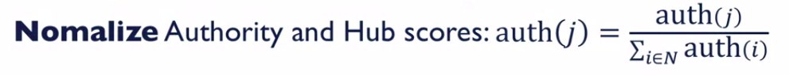</a>
			</p>
	* Repeat this process **k** times
	* Example
		1. Iteration 1
			* 1st Iteration
				<p align="center">
				  <a href="javascript:void(0)" rel="noopener">
				 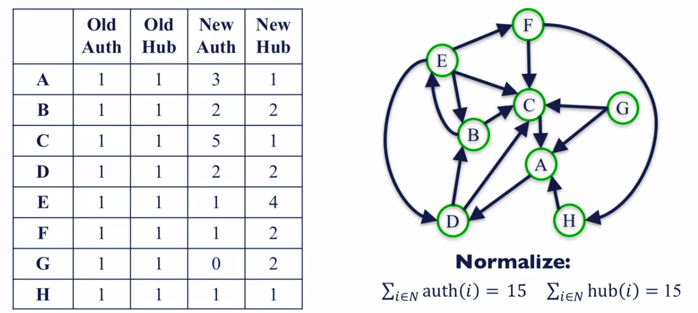</a>
				</p>
			* 1st Iteration with Normalization
				<p align="center">
				  <a href="javascript:void(0)" rel="noopener">
				 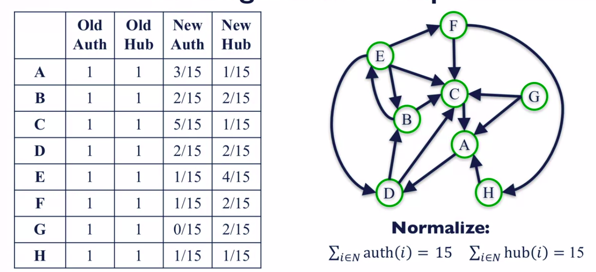</a>
				</p>
		1. Iteration 2
			* 2nd Iteration
				<p align="center">
				  <a href="javascript:void(0)" rel="noopener">
				 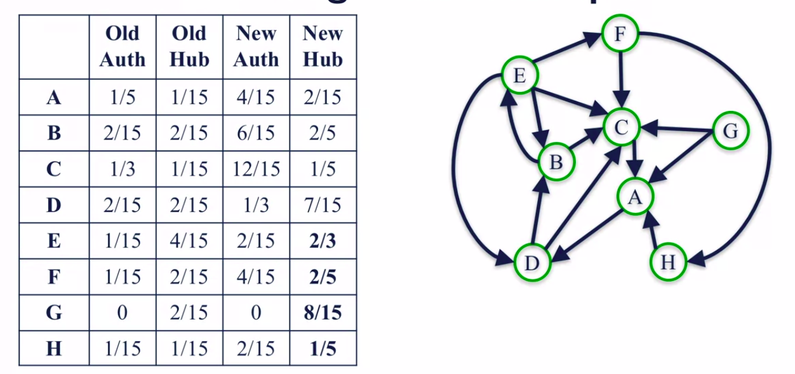</a>
				</p>
			* 2nd Iteration with Normalization
				<p align="center">
				  <a href="javascript:void(0)" rel="noopener">
				 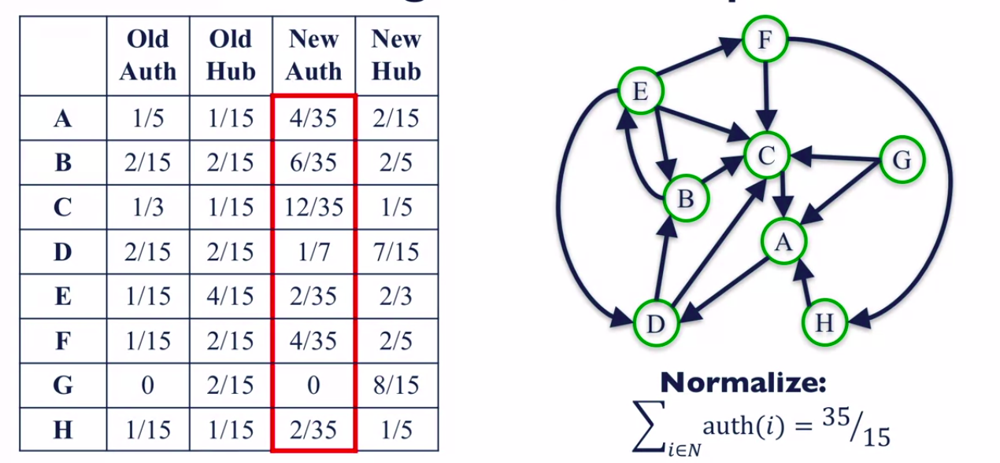</a>
				</p>
				<p align="center">
				  <a href="javascript:void(0)" rel="noopener">
				 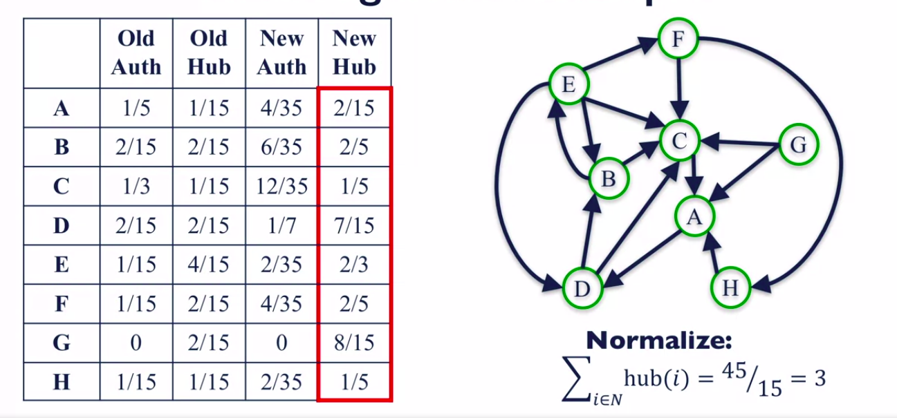</a>
				</p>
		1. After __n__ iterations
			* for some nodes these scores aren't changing, but for others they are changing
				* Output after 6 Iterations
					<p align="center">
					  <a href="javascript:void(0)" rel="noopener">
					 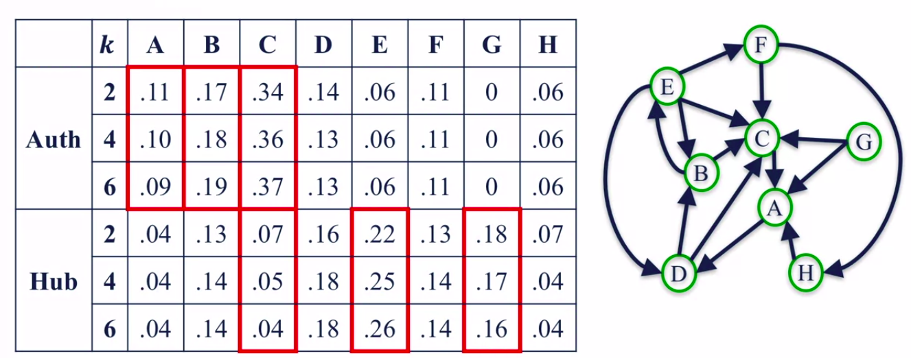</a>
					</p>
				* For most networks, as **k** gets larger, authority and hub scores converge to a unique value
				* Nodes with highest authority score are B and C, and Nodes with highest hub score are D and E
				* After **n** iterations
					<p align="center">
					  <a href="javascript:void(0)" rel="noopener">
					 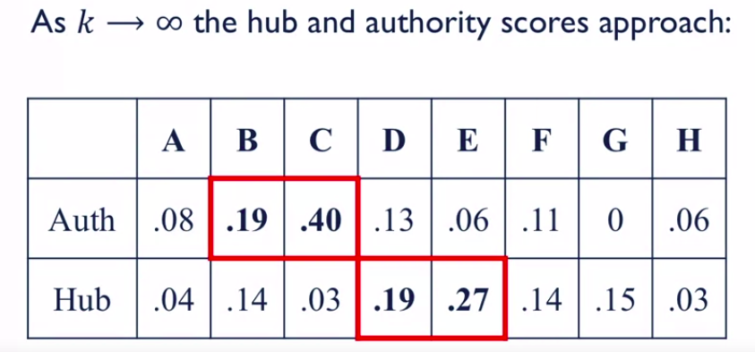</a>
					</p>
	* Using NetworkX
		<p align="center">
		  <a href="javascript:void(0)" rel="noopener">
		 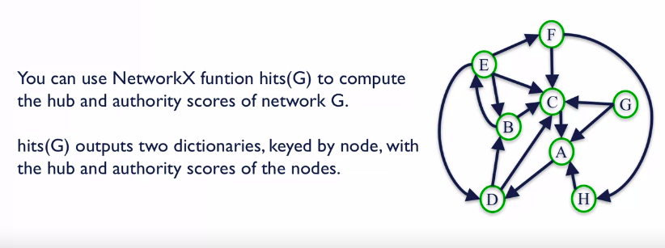</a>
		</p>

##### Summary

* **Nodes** that have **incoming edges** from **good hubs** are thought to be **good authorities**, and then **nodes** that have **outgoing edges** to **good authorities** are thought to be **good hubs**
<p align="center">
  <a href="javascript:void(0)" rel="noopener">
 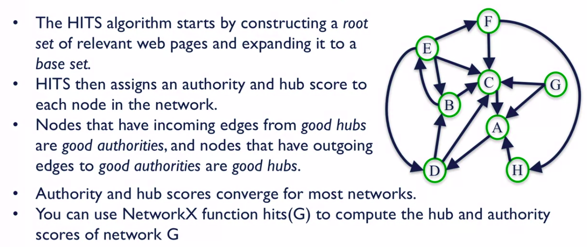</a>
</p>


### Centrality Examples

* **Closeness Centrality** says that nodes who are central are a short distance away from all the other nodes in the network

##### Summary

<p align="center">
  <a href="javascript:void(0)" rel="noopener">
 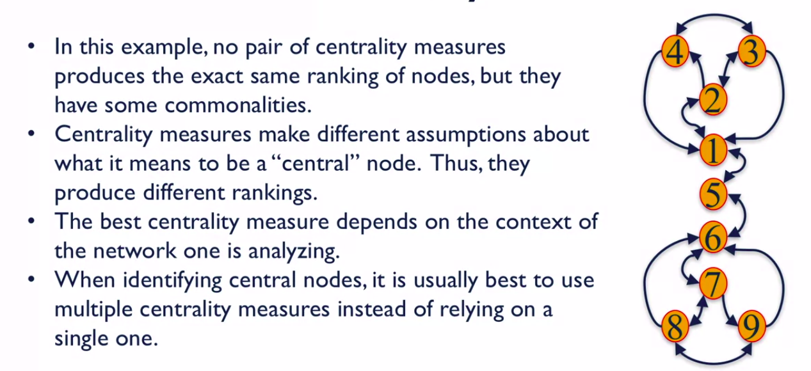</a>
</p>
