Applied Social Network Analysis in Python
=========================================

by University of Michigan

# Module 4
#
## Title: Network Evolution

### Preferential Attachment Model

* The **degree** of a node in an undirected graph is the number of neighbors that it has
* The **degree distribution** of a graph is the probability distribution of the degrees over the entire network
		<p align="center">
		  <a href="javascript:void(0)" rel="noopener">
		 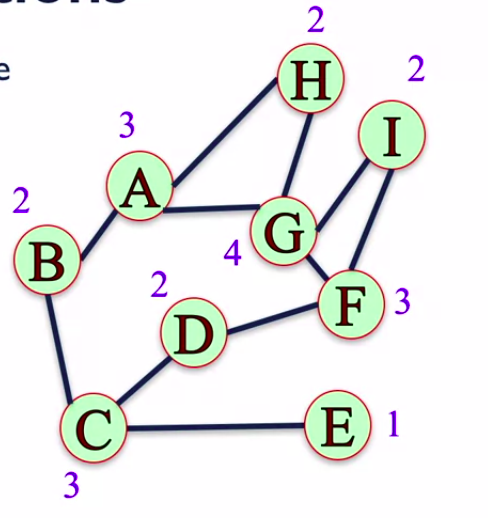</a>
		</p>
	* Example
			<p align="center">
			  <a href="javascript:void(0)" rel="noopener">
			 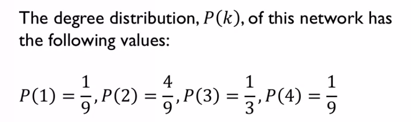</a>
			</p>
		* If we let P(k), where k is degree, be the degree distribution of this network, we'll find that P(k) has the following values
			1. P(1) would be 1/9 because only one node, node E, has degree one out of all nine nodes
			1. P(2) will be 4/9 because there are four nodes that have degree two over the nine nodes
			1. P(3) is 3/9 or one-third because three nodes have degree three.
			1. P(4) would be 1/9 because only one node, node G, has degree four out of all nine nodes
	* Using NetworkX
		```python
		>>> degree = G.degree()
		>>> degree_values = sorted(set(degree.values()))
		>>> histogram = [list(degree.values()).count(i)/float(nx.number_of_nodes(G)) for i in degree_values]
		>>> 
		>>> # Constructing a histogram
		>>> import matplotlib.pyplot as plt
		>>> plt.bar(degree_values, histogram)
		>>> plt.xlabel('Degree')
		>>> plt.ylabel('Fraction of Nodes')
		>>> plt.show()
		>>> # Output shown in image below
		```
		<p align="center">
		  <a href="javascript:void(0)" rel="noopener">
		 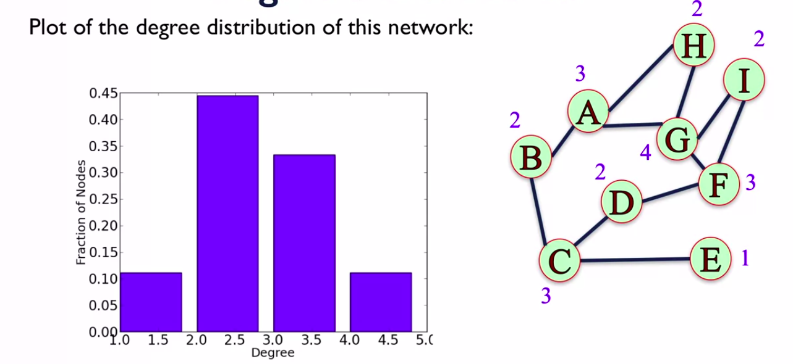</a>
		</p>
* Sometimes while working with directed graphs instead of undirected graphs, we would be looking at the in-degree or the out-degree of the nodes
	* Usually, we consider the in-degree
		* The **in-degree** of a node in a directed graph is the number of in-links it has
			* Example
					<p align="center">
					  <a href="javascript:void(0)" rel="noopener">
					 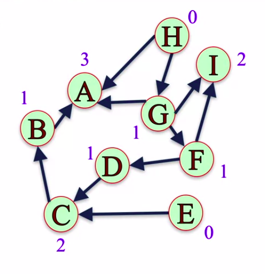</a>
					</p>
					<p align="center">
					  <a href="javascript:void(0)" rel="noopener">
					 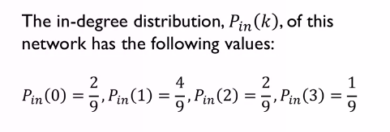</a>
					</p>
				* Look at the in-degree distribution, say P<sub>in</sub>(k), that degree distribution would have these values
					1. P<sub>in</sub>(0) is 2/9 because two nodes have degree zero
					1. P<sub>in</sub>(1) is 4/9 because four of the nodes have in-degree one
					1. P<sub>in</sub>(2) is 2/9 because two of the nodes have in-degree two
					1. P<sub>in</sub>(3) is 1/9 because one of the nodes have in-degree three
			* Using NetworkX
				```python
				>>> in_degree = G.in_degree()
				>>> in_degree_values = sorted(set(in_degree.values()))
				>>> histogram = [list(in_degree.values()).count(i)/float(nx.number_of_nodes(G)) for i in in_degree_values]
				>>> 
				>>> # Constructing a histogram
				>>> import matplotlib.pyplot as plt
				>>> plt.bar(in_degree_values, histogram)
				>>> plt.xlabel('In Degree')
				>>> plt.ylabel('Fraction of Nodes')
				>>> plt.show()
				>>> # Output shown in image below
				```
				<p align="center">
				  <a href="javascript:void(0)" rel="noopener">
				 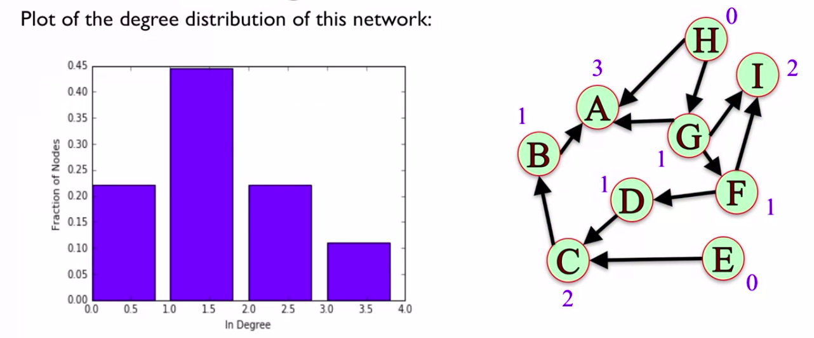</a>
				</p>
* __Degree Distribution in Real Networks__
				<p align="center">
				  <a href="javascript:void(0)" rel="noopener">
				 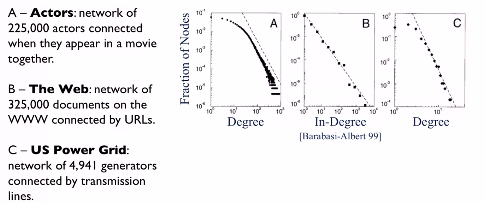</a>
				</p>
	* The first thing is that they're all in **log-log** scale, meaning that the **x-axis** and the **y-axis** are **both** on **log scale** rather than linear scale
	* When you have a degree distribution on a log-log scale and it looks kind of like a straight line, then we say that this degree distribution looks kind of like a **power law**
	* A power law degree distribution would have the form P(k) equals C times k to the power (negative alpha)
		* Formula
			* P(k) = Ck<sup>-alpha</sup>
			* P(k) = Ck<sup>-α</sup>
				* where **C** and **alpha** or **α** are constant
					* **alpha** or **α** values for these three distributions that we have here are **2.3 for A, 2.1 for B, 4 for C**
	* The thing to know about power law degree distributions is
		* They tend to have most of the nodes with very, very small degree
		* They have a few nodes that accumulate a very, very large degree
* **Preferential Attachment Model** is one of the model that have achieved **power law**-like degree distribution.
* **Preferential Attachment Model**
	* How it works
		1. Start with two nodes connected by an edge
		1. At each time step, add a new node with an edge connecting it to an existing node
		1. Choose the node to connect to at random with probability proportional to each node's degree
		1. The probability of connecting to a node **u** of degree **k<sub>u</sub>** is **k<sub>u</sub>/ε<sub>j</sub>k<sub>j</sub>**
	* Example
		* Probability that node 8 attaches to node 3
			* The degree of node 3 is 2 and the sum of all nodes’ degrees is 12 (degree of node 2 is 5, node 1 is 1, node 3 is 2, node 4 is 1, node 5 is 1, node 6 is 1, node 7 is 1)
				* Hence p = 2/12 = 0.17
					<p align="center">
					  <a href="javascript:void(0)" rel="noopener">
					 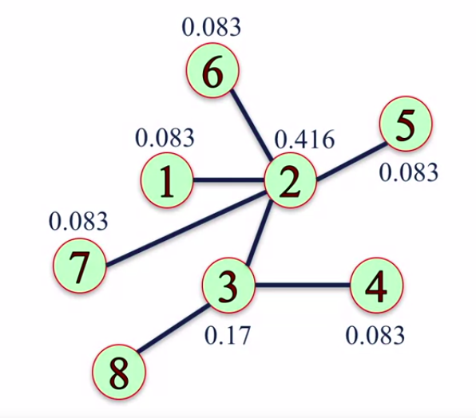</a>
					</p>
		* Notice here is that as node two started to get larger and larger degree, its probability of getting a new edge became larger and larger as well
			* There is this sort of rich get richer phenomenon, where as the nodes get larger and larger degree, they also start to become more and more likely to increase their degree
	* As the number of nodes inceases, the degree distribution of the network under the preferential attachment model approaches the power law P(k) = Ck<sup>-3</sup> with constant C
	* The Preferential Attachment Model produces networks with degree distributions similar to real networks
		<p align="center">
		  <a href="javascript:void(0)" rel="noopener">
		 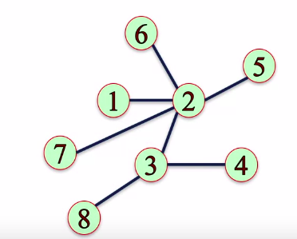</a>
		</p>
	* **For example**, if we believe that a very popular actor that has appeared with many other actors in movies has a higher likelihood of getting an additional actor to co-appear in a movie than a maybe less popular actor that has not appeared with many other actors in movies, then this is the kind of mechanism that could be explaining the sort of very skewed power law distribution that we observed
	* Using NetworkX
		* We can use function **barabasi_albert_graph(n, m)**, which is named after the researchers that came up with this model
			* Returns a network with __n__ nodes. Each new node attaches to __m__ existing nodes according to the Preferential Attachment Model
				* where __n__ is the number of nodes and __m__ is the number of new nodes that an arriving node would attach to
				* In our example, the way we define it, this m parameter would be one because we said that every new node would attach to only a single existing node
					* but you can generalize this and have it so that every node attaches to m existing nodes, and that m will not change the fact that you still get a power law degree distribution
		```python
		>>> # Created one graph with a million nodes and an m = 1
		>>> # so every node attaches to a single existing node
		>>> G = nx.barabasi_albert_graph(1000000, 1)
		>>> 
		>>> degree = G.degree()
		>>> degree_values = sorted(set(degree.values()))
		>>> histogram = [list(degree.values()).count(i)/float(nx.number_of_nodes(G)) for i in degree_values]
		>>> 
		>>> # Constructing a Scatter Plot
		>>> import matplotlib.pyplot as plt
		>>> plt.plot(degree_values, histogram, 'o')
		>>> plt.xlabel('Degree')
		>>> plt.ylabel('Fraction of Nodes')
		>>> plt.xscale('log')
		>>> plt.yscale('log')
		>>> plt.show()
		>>> # Output shown in image below
		```
		<p align="center">
		  <a href="javascript:void(0)" rel="noopener">
		 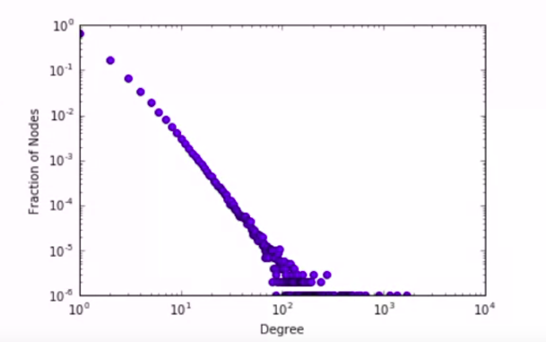</a>
		</p>
		
##### Summary

<p align="center">
  <a href="javascript:void(0)" rel="noopener">
 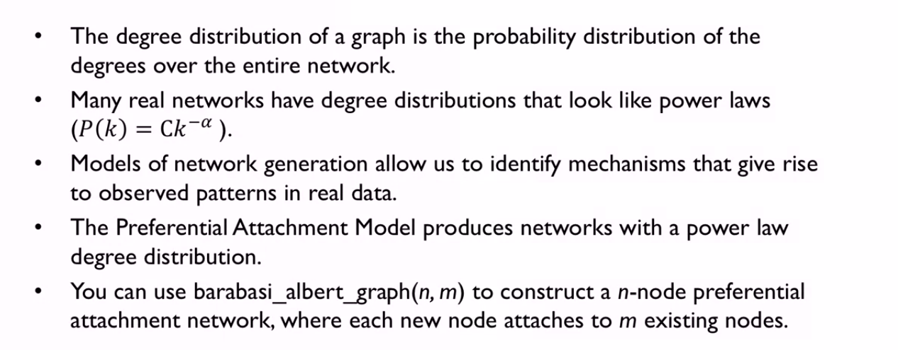</a>
</p>


### Small World Networks

* Small world phenomenon, which suggests that the world is small in the sense that, we're all connected by very short paths between each other
* Social networks tend to have a high clustering coefficient and two, they tend to have small average path length
* **Clustering Coefficient**
	* Local Clustering Coeffecient of a Node
		* Fraction of pairs of the node's friends that are friends with each other
		* Example
			1. Facebook Network 2011: High average Clustering Coefficient (decreases with degree)
				* CC decreases as Degree increases
					<p align="center">
					  <a href="javascript:void(0)" rel="noopener">
					 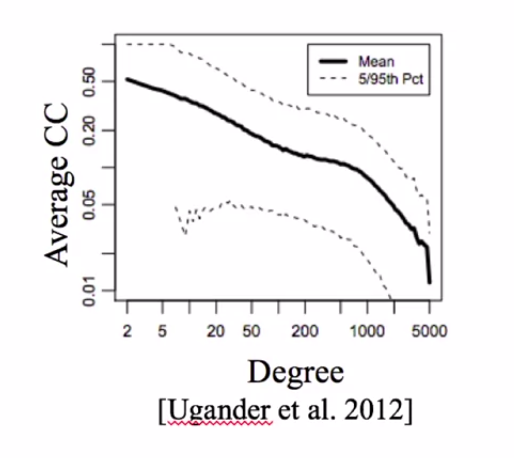</a>
					</p>
			1. Microsoft Instant Message Network: Average Clustering Coefficient is 0.13
			1. IMDB actor network: Average Clustering Coefficient is 0.78
				* these clustering coefficients are high because, if you imagine that these graphs were completely random. Meaning, you take all of these nodes and whatever number of edges it has and you kind of just assign them at random, then you would find that the average clustering coefficient would be much, much smaller because there is nothing that's sort of making these triangles appear, and so, these clustering coefficients tend to be high
* Path Length and Clustering
	* Two things about social networks
		1. Social networks tend to have a high clustering coefficient
		1. they tend to have small average path length
* To check if Preferential Attachment Model follows above mentioned properties of social networks (under "Path Length and Clustering")
	* Using NetworkX
		```python
		>>> # Created one graph with a 1000 nodes and an m = 4
		>>> # so every node attaches to a four existing node
		>>> G = nx.barabasi_albert_graph(1000, 4)
		>>> print(nx.average_clustering(G))
			0.0202859
		>>> print(nx.average_shortest_path_length(G))
			4.1694294
		```
	* If we vary the number of nodes (n) or the number of edges per new node (m)
		* Small average shortest path: high degree nodes act as hubs and connect many pairs of nodes
			<p align="center">
			  <a href="javascript:void(0)" rel="noopener">
			 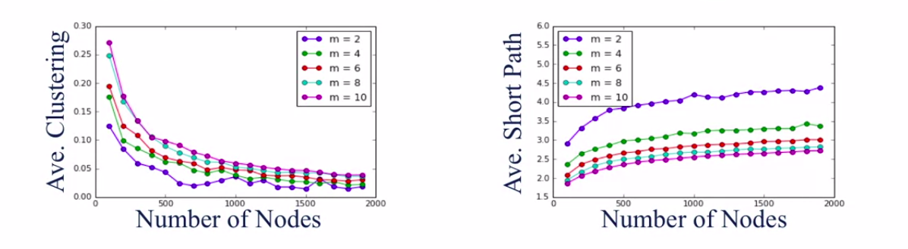</a>
			</p>
		* Clustering side, as the number of nodes increases, the average clustering coefficient also decreases and it becomes very small
	* Seems like the **Preferential Attachment Model**, while it has the small average shortest path property, **fails** to have high cluster and coefficient property
		* the reason is that, there is no mechanism in the preferential attachment model that would favor triangle formation. So it's natural that it just doesn't have that property
* **Small World Model**
	* How it works
		1. Start with a ring of __n__ nodes (i.e. to put __n__ nodes in circle), where each node is connected to its __k__ nearest neighbors
		1. Fix a parameter, p ∈ [0,1]
		1. Consider each edge **(u, v)**. With probability __p__, select a node __w__ at random and rewrite the edge **(u, v)** so it becomes **(u, w)**
	* Example
		1. We have 12 nodes, and in the example, k will be 2, so each node is connected to its 2 nearest neighbors and p will be 0.4
			* These parameters k = 2 and p = 0.4 are not the typical parameters you would use for this particular model. Typically, you have a k that's much larger, and a p that's much smaller but just for the purposes of the illustration we are using these params
			* Network when Starting
				<p align="center">
				  <a href="javascript:void(0)" rel="noopener">
				 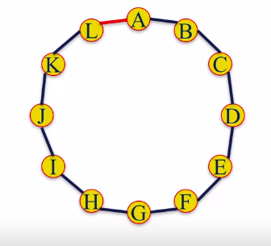</a>
				</p>
			* Network when Ended
				* the network that these model produces, or at least one of the possible instances of of these networks that can be produced with these parameters
					<p align="center">
					  <a href="javascript:void(0)" rel="noopener">
					 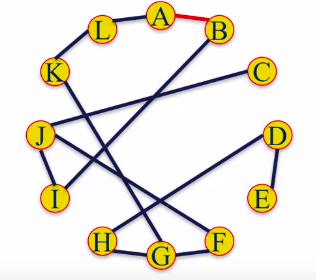</a>
					</p>
		1. Small World Model with Varying __p__ value
			* When p is 0,
				* What we have is a completely regular lattice. So there is no rewiring, and because every node is connected to k of its neighbors, then there are lots of triangles that get formed locally
					* Because, well it depends on the value of k, but if k is large, then it start to form many triangles. And so this network will have pretty high clustering coefficient because it purposely going to form triangles in the beginning
				* Therefore, nothing gets rewire, nothing gets changed, so it has a pretty high clustering coefficient
			* When p is 1,
				* We're going to rewire every single one of the edges, and so that would be this network
				* We're going to rewire every single edge. And so this network is now completely random
				* We've created a bunch of long bridges. And so presumably, distances are pretty small between different nodes
					* So, we kind of destroyed the sort of local structure that we had before. And so now we probably don't have many triangles
				* While the distances are small, while the clustering also got very small
			* When 0 < p < 1,
				* Some edges get rewire, so you create some long bridges
				* The distances between nodes, the average distance gets reduced. But the local structure depending on p can be maintained
					* So you can maintain that high clustering
				* Some edges are re-wired. Network conserves some local structure but has some randomness
					<p align="center">
					  <a href="javascript:void(0)" rel="noopener">
					 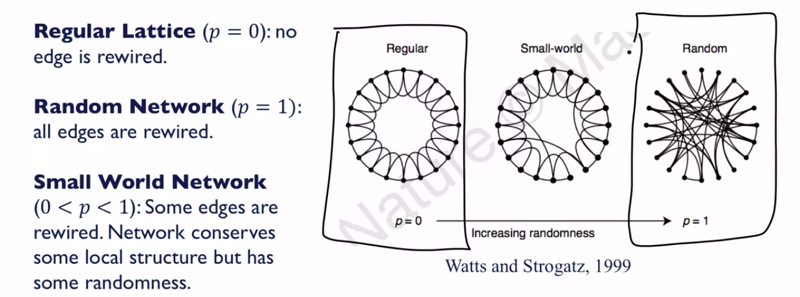</a>
					</p>
* What is the average clustering coefficient and shortest path of a small world network? 
	* It depends on the parameters __k__ and __p__
	* As __p__ increase from 0 to 0.1
		* average shortest path decreases rapidly
		* average clustering coefficient decreases slowly
			<p align="center">
			  <a href="javascript:void(0)" rel="noopener">
			 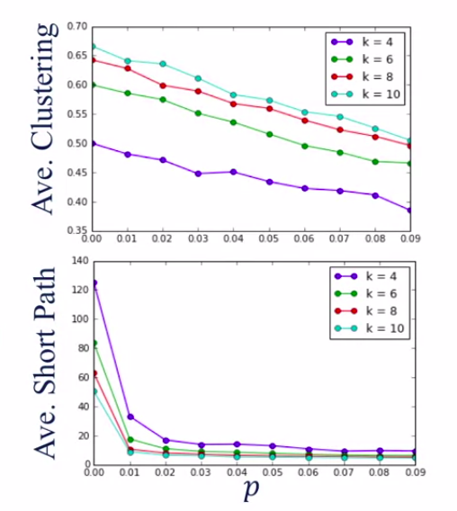</a>
			</p>
		* Example
			1. An instance of network of 1000 nodes, k=6, and p=0.04
				* average shortest path : 8.99
				* average clustering coefficient : 0.53
				* These types of values of __p__, we can achieve both of the properties : The average shortest path being small, single digit, and the average clustering coefficient being large
* Using NetworkX
	* **watts_strogatz_graph(n, k, p)** function in networkX can be used for Small World Model
	* It returns a small world network with __n__ nodes that starts with the ring lattice, where each node is connected to its __k__ nearest neighbors, and it has rewiring probability __p__
	* Degree distribution of Small World Model
		```python
		>>> G = nx.watts_strogatz_graph(1000, 6, 0.04)
		>>> 
		>>> degree = G.degree()
		>>> degree_values = sorted(set(degree.values()))
		>>> histogram = [list(degree.values()).count(i)/float(nx.number_of_nodes(G)) for i in degree_values]
		>>> 
		>>> # Constructing a Histogram
		>>> import matplotlib.pyplot as plt
		>>> plt.bar(degree_values, histogram, 'o')
		>>> plt.xlabel('Degree')
		>>> plt.ylabel('Fraction of Nodes')
		>>> plt.show()
		```
		<p align="center">
		  <a href="javascript:void(0)" rel="noopener">
		 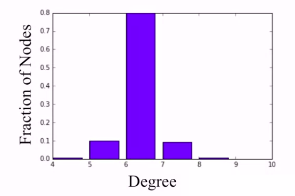</a>
		</p>
* **Small World Model** doesn't get the power level degree distribution that we also observe in real networks. And the preferential attachment model gets correctly
* Variants of Small World Model in NetworkX
	* Small World Network can be disconnected, which is sometimes undesirable
	* **connected_watts_strogatz_graph(n, k, p, t)** function **runs watts_strogatz_graph(n, k, p)** upto __t__ times, until it returns a connected small world network
	* **newman_watts_strogatz_graph(n, k, p)** function runs a model similar to the small world model, but rather than rewiring edges, new edges are added with probability __p__
		* which is very similar to its small world model. But instead of rewiring the edges, when it's time to rewire an edge, it actually adds a new edge and leaves the other one still in the network, and still does this with probability __p__
			* So instead of rewiring, it adds additional edges

> The degree distribution of small world network is not a power law because the degree of most nodes lie in the middle.

##### Summary

<p align="center">
  <a href="javascript:void(0)" rel="noopener">
 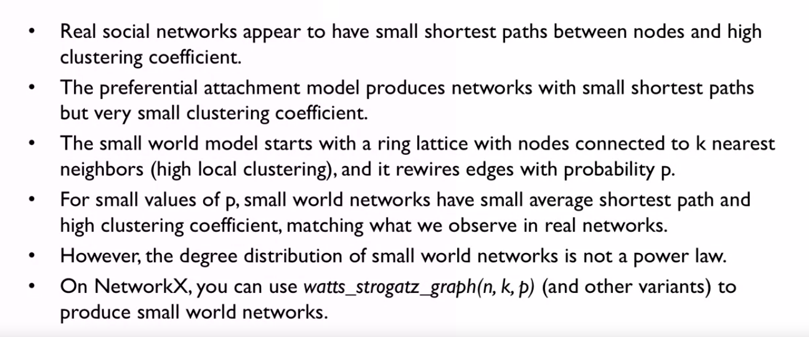</a>
</p>


### Link Prediction

* Measures
	1. **Common Neighbors**
		<p align="center">
		  <a href="javascript:void(0)" rel="noopener">
		 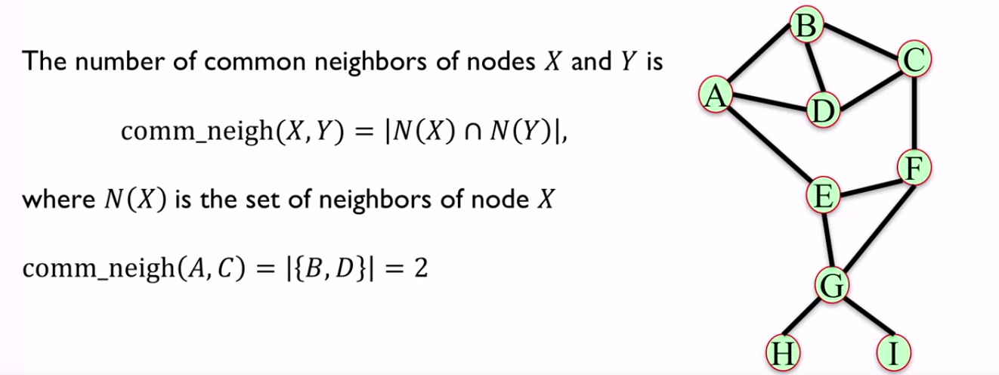</a>
		</p>
	1. **Jaccard Coefficient**
		* Number of common neighbors normalized by the total number of neighbors
			<p align="center">
			  <a href="javascript:void(0)" rel="noopener">
			 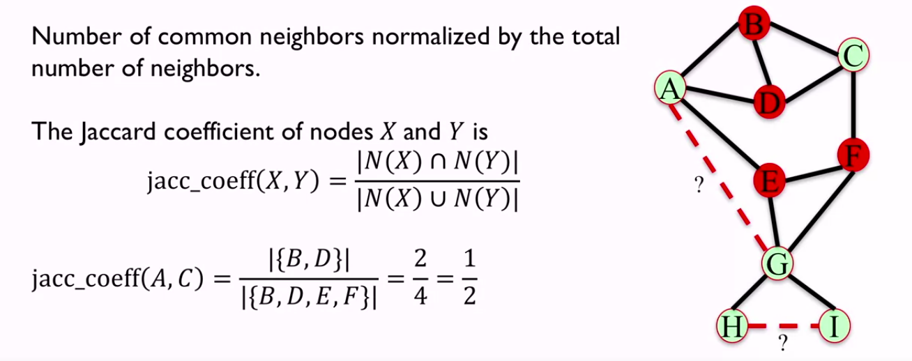</a>
			</p>
		* Using NetworkX
			* if we sort this list, we now find that I, H have the highest Jaccard coefficient of 1. And that's because I and H are both connected to a single neighbor which is a common neighbor G. Whereas the nodes A and G, they have one common neighbor, but they have more neighbors that are in the union of the neighbors of A and G. And so, therefore, they have a lower Jaccard coefficient
				```python
				>>> L = list(nx.jaccard_coefficient(G))
				>>> L.sort(key=operator.itemgetter(2), reverse=True)
				```
				<p align="center">
				  <a href="javascript:void(0)" rel="noopener">
				 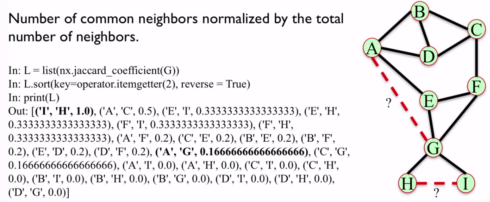</a>
				</p>
	1. **Research Allocation Index**
		* Fraction of a "resource" that a node can send to another through their common neighbors
		* In this case, if X and Y have a lot of common neighbors and they're going to have a large Resource Allocation index. But if they have a lot of neighbors that have low degree, then they're going to have an even larger Resource Allocation index
			<p align="center">
			  <a href="javascript:void(0)" rel="noopener">
			 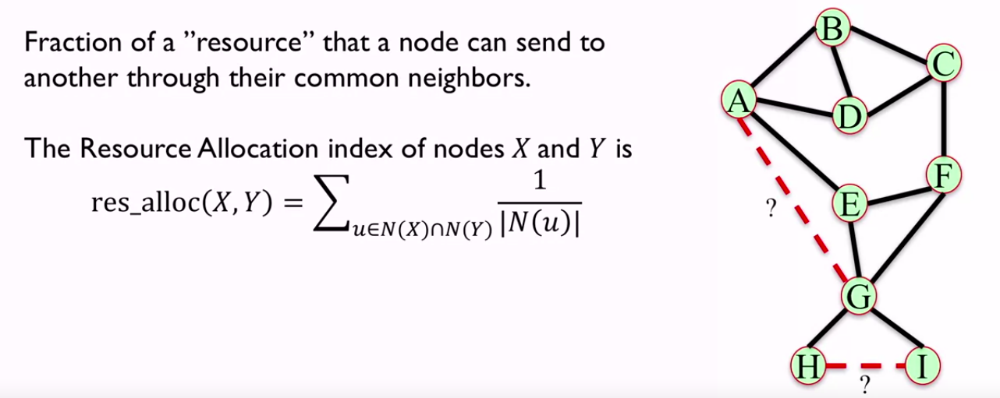</a>
			</p>
		* Using NetworkX
			* A, G has a higher Resource Allocation index than I, H. And that is because I, H has a common neighbor which is G. But G has a high degree, has a degree of four
				* Whereas A, G, they're common neighbor is E, and E has a slightly smaller degree of three. So, that will give A, G a larger Resource Allocation index than I, H
			<p align="center">
			  <a href="javascript:void(0)" rel="noopener">
			 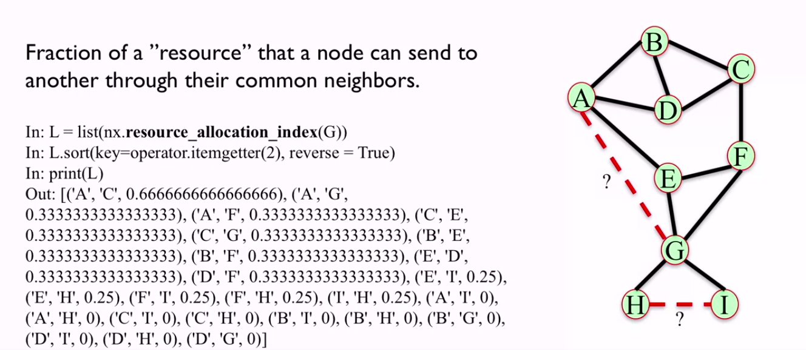</a>
			</p>
	1. **Adamic-Adar Index**
		* It is very similar to the research allocation index. The only difference is that rather than dividing by the degree, it divides by the log of the degree
			<p align="center">
			  <a href="javascript:void(0)" rel="noopener">
			 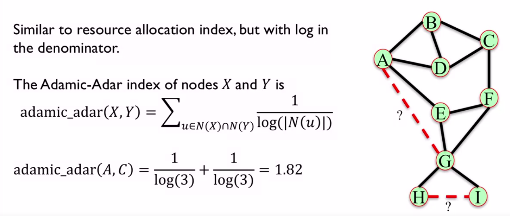</a>
			</p>
	1. **Preferential Attachment**
		* In the Preferential Attachment model, nodes with high degree get more neighbors
		* Product of the node's degree
			<p align="center">
			  <a href="javascript:void(0)" rel="noopener">
			 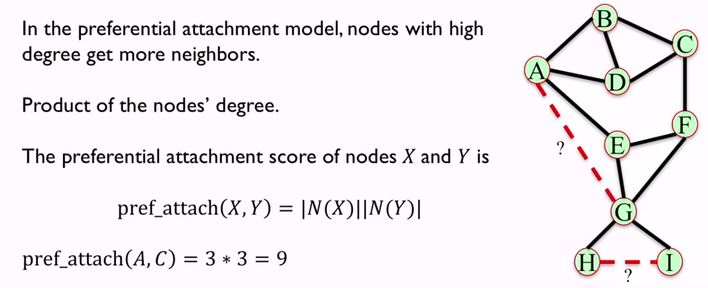</a>
			</p>
		* Using NetworkX
			* A, G has a higher preferential attachment score than I, H, and that's because A has a degree of 3 and G has a degree of 4, which makes the preferential attachment score of 12. Whereas, I and H both only have one neighbor and so they have a score of 1
				<p align="center">
				  <a href="javascript:void(0)" rel="noopener">
				 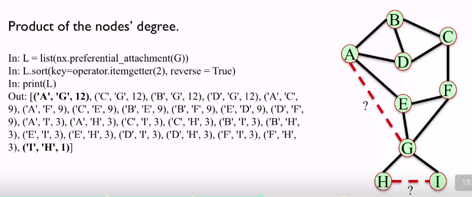</a>
				</p>
			```ruby
			In cases where you have a network and on top of the network, you have some knowledge about different communities. And here we'll think of communities as sets of nodes and we'll make the assumption that each node belongs only to one community, we will look at 2 measures related to this
				1. Community Stucture
					* Some measures consider the community structure of the network for link prediction
					* Pair of nodes who belong to the same community and have many common neighbors in their community are likely to form an edge
			```
			<p align="center">
			  <a href="javascript:void(0)" rel="noopener">
			 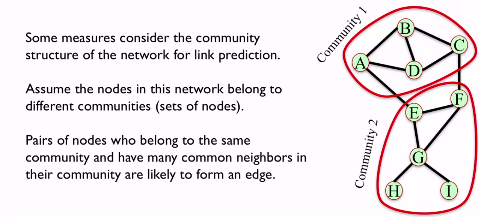</a>
			</p>
	1. **Community Common Neighbors**
		* Number of common neighbors with bonus for neighbor in same community
			<p align="center">
			  <a href="javascript:void(0)" rel="noopener">
			 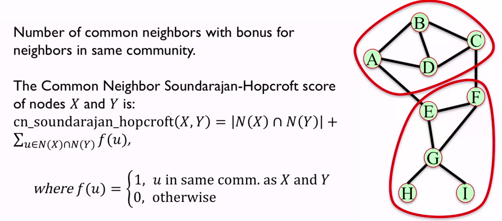</a>
			</p>
		* Example
			1. nodes A and C, their common neighbors are B and D, and they all belong to the same community. So A and C would get a score of 2 for having two common neighbors plus 2 bonus points, so we get 4
			1. Nodes E and I would have a score of 2 because they both have a common neighbor, namely, G. And it belongs to the same community. So it would get a bonus point for a total of 2
			1. edge A, G for example, they have one common neighbor, namely, E. But A and G are not in the same community. So E is not in the same community as A and G. Therefore A and G have a score of just 1
		* Using NetworkX
			* We first have to tell network X which communities each node belongs to
			* So here, we're adding an attribute to each one of the nodes named, community, that tells which community the node belongs to
				* for __A__ through __D__, we'll say it belongs to __community 0__
				* for the __other__ ones it belongs to the __community 1__
					<p align="center">
					  <a href="javascript:void(0)" rel="noopener">
					 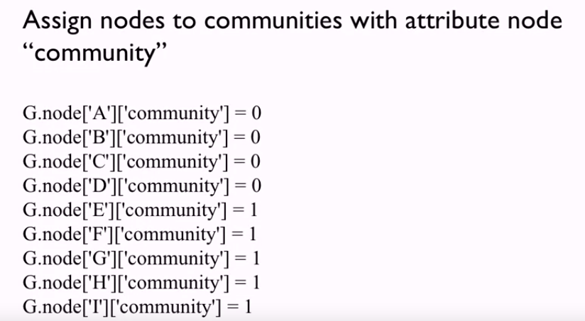</a>
					</p>
			* **cn_soundarajan_hopcroft(G)** function of networkX can be used
				* I, H has a score of 2, because their common neighbor G belongs to the same community as A do, whereas A, G has a score of 1
					<p align="center">
					  <a href="javascript:void(0)" rel="noopener">
					 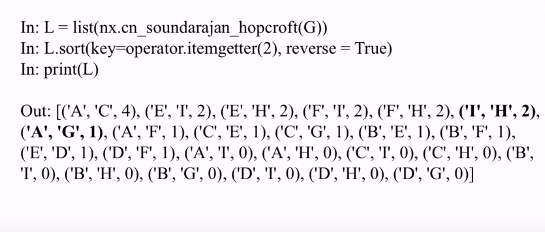</a>
					</p>
	1. **Community Resource Allocation**
		* It is similar to the Resource Allocation index but it only takes into account nodes that are in the same community
			* this measure called the Resource Allocation Soundarajan-Hopcroft score
			*  f(u) again is the same as before is 1, if u belongs to the same community as X and Y, and 0 otherwise
				<p align="center">
				  <a href="javascript:void(0)" rel="noopener">
				 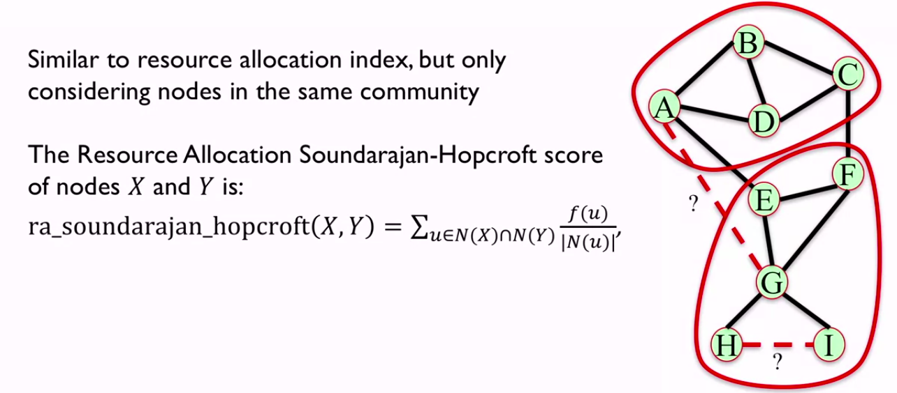</a>
				</p>
			* Example
				1. nodes A and C, we would find that, well, because both of the neighbors B and D belong to the same community as A, C. Then we have the same score as we did before, and 1 over 3 plus 1 over 3, which is two-thirds for this Resource Allocation index
				1. nodes E and I, we find that well, they have one common node which is node G. And node G has a degree of 4, so it has a score of 1 over 4 because G belongs to same community as E and I
				1. two nodes that are not in the same community like A and G. Then they would have score 0 because their common neighbor, while they have one, namely E, belongs to a different community as at least one of the two nodes. And so, it doesn't contribute anything to the sum, so these two don't get anything in the sum
					<p align="center">
					  <a href="javascript:void(0)" rel="noopener">
					 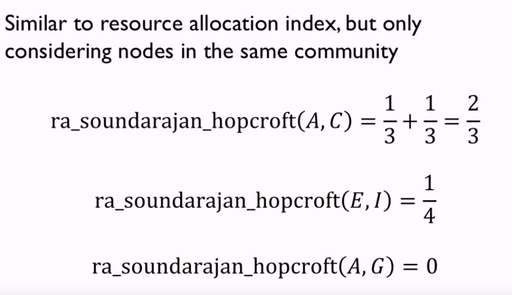</a>
					</p>
			* Using NetworkX
				* **a_index_soundarajan_hopcroft** function can be used to compute the scores of all the non edges
					<p align="center">
					  <a href="javascript:void(0)" rel="noopener">
					 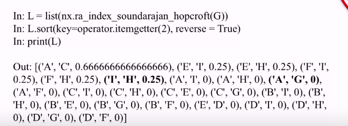</a>
					</p>
* Function **common_neighbors**, which takes in as input the graph to nodes. And it outputs an iterator of all the common neighbors of the two nodes
* **non_edges** function of NetworkX can be used to get the nodes that don't have an edge between them
	```python
	>>> common_neigh = [(e[0], e[1], len(list(nx.common_neighbors(G, e[0], e[1])))) for e in nx.non_edges(G)]
	>>> 
	>>> sorted(common_neigh, key=operator.itemgetter(2), reverse=True)
	>>> 
	>>> print(common_neigh)
	```
	<p align="center">
	  <a href="javascript:void(0)" rel="noopener">
	 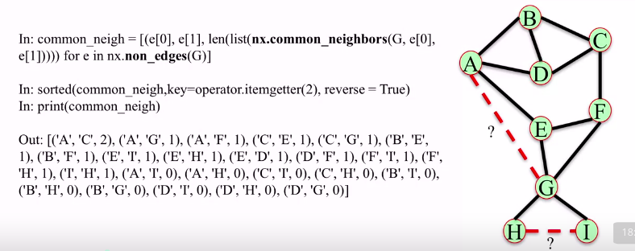</a>
	</p>

> **If you're actually trying to solve the *`link-prediction`* problem, typically what would happen is that you would use these measures as features. And then you would use a classifier, if you have some label data, you would train a classifier and use these measures as features in order to make the prediction**

##### Summary

<p align="center">
  <a href="javascript:void(0)" rel="noopener">
 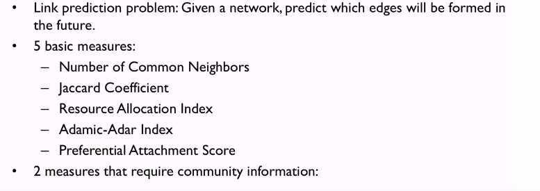</a>
</p>

